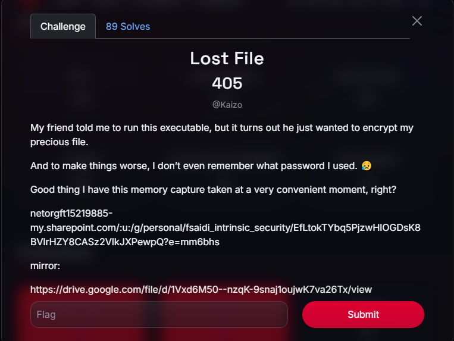
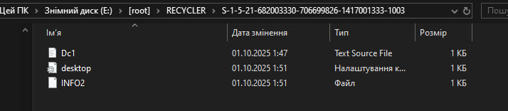
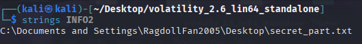
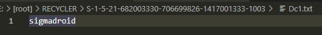
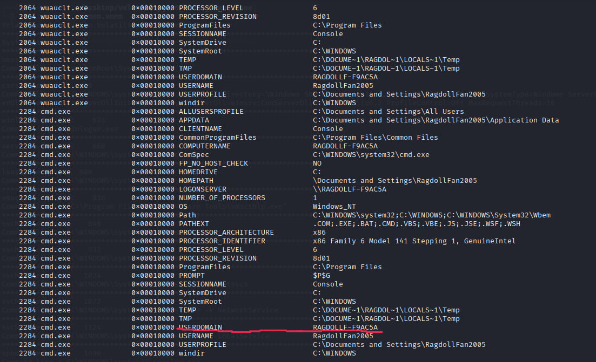
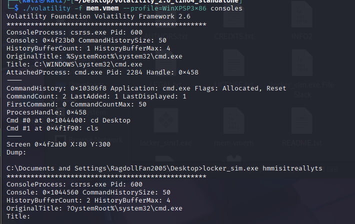
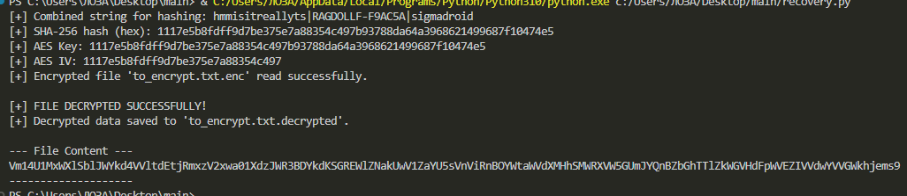
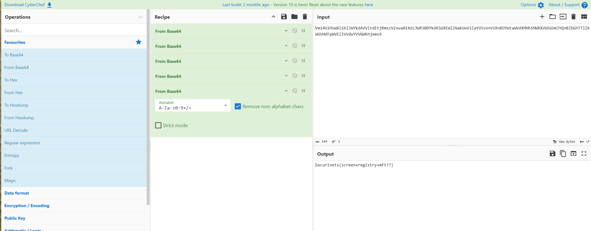

# Securinets CTF Quals 2025 - Lost File 302 Write-up

7z archive: [lostfile.7z](https://drive.google.com/file/d/1Vxd6M50--nzqK-9snaj1oujwK7va26Tx/view)



## Introduction

In this challenge, we were provided with two artifacts: a disk image `disk.ad1` and a memory dump `mem.vmem`. The story is that a friend ran an executable which encrypted an important file. Our goal is to recover the encrypted file by finding the lost encryption key.

## Step 1: Disk Forensics

We begin by analyzing the `disk.ad1` image to understand the file landscape.

### 1.1. Mounting the Image

Using **FTK Imager**, we mount `disk.ad1` as a logical drive (E:). This allows us to browse its file structure, including any deleted files.

### 1.2. Filesystem Exploration

On the user's desktop (`E:\[root]\Documents and Settings\RagdollFan2005\Desktop`), we identify two key files:
*   `locker_sim.exe` — The executable, presumed to be the encryptor.
*   `to_encrypt.txt.enc` — Our encrypted target file.

Next, we investigate the Recycle Bin (`E:\[root]\RECYCLER\S-1-5-21-682003330-706699826-1417001333-1003`), where we find some interesting artifacts.



### 1.3. Recovering the Deleted File

Inside the Recycle Bin, we find:
- **`INFO2`**: A metadata file used by Windows XP to store information about deleted files.
- **`Dc1.txt`**: A renamed, deleted file.

Using the `strings` utility, we analyze `INFO2` to find the original path of the deleted file.



The output, `C:\Documents and Settings\RagdollFan2005\Desktop\secret_part.txt`, confirms that a file named `secret_part.txt` was deleted from the desktop. Therefore, `Dc1.txt` must be our deleted file. Opening it reveals its content:



**Third Key Component:** `sigmadroid`

## Step 2: Reverse Engineering `locker_sim.exe`

To understand how the program generates the encryption key and what it needs to do so, we perform a static analysis of the `locker_sim.exe` executable using a disassembler (like IDA Pro). The core logic is concentrated in the `_main` function, which starts at address `.text:00401A7A`.

The analysis of this function shows that the program sequentially gathers three pieces of data, combines them, and then uses the result to create the encryption key.

### 2.1. Obtaining the Command Line Argument (`<arg>`)

At the very beginning of its execution, the program accesses the arguments it was launched with.

```assembly
.text:00401A97                 cmp     dword ptr [ebx], 1 ; Checks if arguments exist (argc > 1)
.text:00401A9A                 jg      short loc_401AA6   ; If yes, proceeds to handle them

.text:00401AA6 loc_401AA6:
.text:00401AA6                 mov     eax, [ebx+4]    ; Loads a pointer to the argv array into EAX
.text:00401AA9                 mov     eax, [eax+4]    ; Loads a pointer to argv[1] (the first argument) into EAX
.text:00401AAC                 mov     [ebp+var_24], eax ; Stores the pointer to <arg> in the local variable var_24
```
**Code Explanation:**
- The program checks the argument count (`argc`). If no arguments are provided, it terminates.
- `mov eax, [eax+4]` loads the address of the second element in the `argv` array (i.e., `argv[1]`), as `argv[0]` is always the program name itself.
- This pointer to the argument string is saved on the stack in the `var_24` variable for later use.

**Conclusion:** The first key component is the **argument passed to the program at launch**.

### 2.2. Obtaining the Computer Name (`<computer_name>`)

Next, the program prepares a buffer on the stack and calls a function to read the computer name from the registry.

```assembly
; Prepares the 'Destination' buffer on the stack to store the result
.text:00401AAF                 lea     edx, [ebp+Destination]
; ... code to clear the buffer ...
.text:00401ACB                 lea     eax, [ebp+Destination]
.text:00401AD1                 mov     [esp], eax      ; Passes the buffer pointer as an argument
.text:00401AD4                 call    _read_computername_from_registry ; Calls the function
```**Code Explanation:**
- The `_read_computername_from_registry` function (address `.text:00401460`) queries the Windows registry at the path `SYSTEM\CurrentControlSet\Control\ComputerName\ComputerName` and reads its value.
- The result (the computer name) is written into the `Destination` buffer, whose address was passed to the function.

**Conclusion:** The second key component is the **name of the computer** where the program is executed.

### 2.3. Obtaining the Content of `secret_part.txt` (`<secret_part_content>`)

The next step is to find the file `secret_part.txt` in its directory, read its content, and then delete it.

```assembly
; Forms the path to the secret_part.txt file
.text:00401C8E                 mov     dword ptr [esp+8], offset Format ; "%ssecret_part.txt"
.text:00401CA7                 call    _snprintf

; Reads the file's content into memory
.text:00401CFE                 lea     eax, [ebp+Buffer] ; Pointer to the file path
.text:00401D04                 mov     [esp], eax      ; FileName
.text:00401D07                 call    _read_file_to_buffer

; Deletes the file immediately after reading
.text:00401D12                 mov     [esp], eax      ; lpFileName
.text:00401D15                 call    _DeleteFileA@4  ; DeleteFileA(x)
```
**Code Explanation:**
- The `_read_file_to_buffer` function allocates memory for the file's content and returns a pointer to this buffer. This pointer is stored in the `[ebp+Block]` variable.
- The call to `_DeleteFileA@4` right after reading explains why we found this file in the Recycle Bin.

**Conclusion:** The third key component is the **content of the `secret_part.txt` file**.

### 2.4. The Crucial Step: Assembling the Final String

This is the most critical part of the analysis. The program uses `_snprintf` to combine all three strings into one, using `|` as a separator. In assembly, arguments for a function are pushed onto the stack in reverse order (right to left).

Here is what happens just before the call to `_snprintf` at `.text:00401D91`:

```assembly
; Prepare the third argument for "%s|%s|%s" (the rightmost %s)
.text:00401D67                 mov     eax, [ebp+Block]  ; Load pointer to secret_part.txt content
.text:00401D6B                 mov     [esp+14h], eax  ; Push it onto the stack

; Prepare the second argument (the middle %s)
.text:00401D71                 lea     eax, [ebp+Destination] ; Load address of the buffer with the computer name
.text:00401D75                 mov     [esp+10h], eax  ; Push it onto the stack

; Prepare the first argument (the leftmost %s)
.text:00401D78                 mov     eax, [ebp+var_24] ; Load pointer to the command line argument
.text:00401D7C                 mov     [esp+0Ch], eax  ; Push it onto the stack

; Pass the format string
.text:00401D84                 mov     dword ptr [esp+8], offset aSSS ; "%s|%s|%s"

; Pass the buffer for the final result
.text:00401D8B                 mov     eax, [ebp+pbData]
.text:00401D8E                 mov     [esp], eax      ; Buffer

; Call the function
.text:00401D91                 call    _snprintf
```
**Code Explanation:**
1.  The **third `%s`** receives `[ebp+Block]` (**secret_part_content**).
2.  The **second `%s`** receives the address of the `[ebp+Destination]` buffer (**computer_name**).
3.  The **first `%s`** receives `[ebp+var_24]` (**arg**).

**Conclusion:** The assembly code unequivocally proves that the string is assembled in the format: **`<arg>|<computer_name>|<secret_part_content>`**.

### 2.5. Key Generation and Encryption

-   **Hash Calculation:** The result of `_snprintf` (stored in `[ebp+pbData]`) is passed to the `_sha256_buf` function, which computes its **SHA-256** hash.
-   **Key and IV Usage:** The resulting 32-byte hash is passed to the `_aes256_encrypt_simple` function, which uses it as both the encryption key and the source for the Initialization Vector (IV). Analysis of `_aes256_encrypt_simple` shows that it uses `CryptSetKeyParam` with the `KP_IV` parameter (`dwParam=1`) to set the first 16 bytes of the hash as the IV.

The encryption algorithm is fully revealed:
1.  **Key Source:** The string `<argument>|<computer_name>|<secret_part.txt_content>`.
2.  **AES Key:** The SHA-256 hash of this string.
3.  **IV:** The first 16 bytes of the SHA-256 hash.
4.  **Algorithm:** AES-256 in CBC mode.

Now we know exactly what to look for in memory to recover the key.

## Step 3: Memory Forensics

Now that we know the algorithm, we need to find the two missing components from the `mem.vmem` dump using **Volatility**.

### 3.1. Finding the Computer Name

We use the `envars` plugin to inspect the environment variables.
```bash
./volatility -f mem.vmem --profile=WinXPSP3x86 envars
```
In the output, we find the `USERDOMAIN` variable:



**Second Key Component:** `RAGDOLLF-F9AC5A`

### 3.2. Finding the Command Line Argument

Since the `locker_sim.exe` process has already terminated, the `cmdline` and `cmdscan` plugins yield no results. We use the `consoles` plugin, which scans console input/output buffers.

```bash
./volatility -f mem.vmem --profile=WinXPSP3x86 consoles
```
This command finds the full command line used to launch the program, including our final unknown component.



**First Key Component:** `hmmisitreallyts`

## Step 4: Decryption

We have assembled all three parts:
1.  **Argument:** `hmmisitreallyts`
2.  **Computer Name:** `RAGDOLLF-F9AC5A`
3.  **`secret_part.txt` content:** `sigmadroid`

We combine them: `hmmisitreallyts|RAGDOLLF-F9AC5A|sigmadroid`

### The `recovery.py` Script

To automate the process, we use a Python script with the `pycryptodome` library.

```python
import hashlib
from Crypto.Cipher import AES
from Crypto.Util.Padding import unpad

# All key components
command_line_arg = "hmmisitreallyts"
computer_name = "RAGDOLLF-F9AC5A"
secret_part_content = "sigmadroid"

# Filenames
encrypted_file_name = "to_encrypt.txt.enc"
decrypted_file_name = "to_encrypt.txt.decrypted"

def decrypt_file():
    """
    Decrypts the file based on the three-part key.
    """
    try:
        # Step 1: Assemble the full string for key generation
        combined_string = f"{command_line_arg}|{computer_name}|{secret_part_content}"
        print(f"[+] Combined string for hashing: {combined_string}")

        # Step 2: Calculate the SHA-256 hash
        sha256_hash = hashlib.sha256(combined_string.encode()).digest()
        print(f"[+] SHA-256 hash (hex): {sha256_hash.hex()}")

        # Step 3: Extract the AES Key and IV
        aes_key = sha256_hash      # The entire 32-byte hash is the key
        aes_iv = sha256_hash[:16]  # The first 16 bytes are the IV
        print(f"[+] AES Key: {aes_key.hex()}")
        print(f"[+] AES IV: {aes_iv.hex()}")

        # Step 4: Read and decrypt the file
        with open(encrypted_file_name, 'rb') as f:
            ciphertext = f.read()
        print(f"[+] Encrypted file '{encrypted_file_name}' read successfully.")
        
        cipher = AES.new(aes_key, AES.MODE_CBC, iv=aes_iv)
        decrypted_padded_data = cipher.decrypt(ciphertext)
        decrypted_data = unpad(decrypted_padded_data, AES.block_size)
        print("\n[+] FILE DECRYPTED SUCCESSFULLY!")

        # Step 5: Save the result
        with open(decrypted_file_name, 'wb') as f:
            f.write(decrypted_data)
        print(f"[+] Decrypted data saved to '{decrypted_file_name}'.")
        
        print("\n--- File Content ---")
        print(decrypted_data.decode('utf-8', errors='ignore'))
        print("--------------------")

    except Exception as e:
        print(f"[-] An error occurred: {e}")

if __name__ == "__main__":
    decrypt_file()
```

Running the script successfully decrypts the file.



## Step 5: Getting the Flag

The decrypted file contains a long Base64 encoded string.
```
Vm14U1MwMUhTbkJpTVdGc1dsZG9WMWxVUm5KVmJGWnpWR3hhVjAxV1ZteGFXRUpoVmpGYVdGb3hTbWhsVm5CUVZteEtWMWx0ZEZkaVJtUnpXbGRvVmxkRlJsaFdWM1JMVm14V2ExSXhXbGRYYlhob1ZqRktjVkZ0Um1sWlZFNUVWVEphVDJOc1duSlRiR1JGVm14c1dGb3hTbWhsVm5CUVZteHdWMWxXWkZobFIwWkxXVmRTZVZkdFVuSlhiRXAwVjJ4YWMySkVUbGhoUjBaWFYxZDRjVlpzUW5KbFZsSlhWbTE0YVZkV1dtcGFWbWhhVmpGU2NWWnNjRmxVYlhaWFYxZDRWMkl4V2xWWGJYcFdZVEpHVjFZeFNraFdiR2hoVmxSS1YxWnNhR0ZXVjNSM1ZtMTQ=
```

We use **CyberChef** for decoding. Applying the **"From Base64"** operation 5 times in a row reveals the final flag.



### **Flag:** `Securinets{screen_registry=mft??}`

## Conclusion

This challenge was an excellent example of a multi-faceted investigation, requiring skills in disk forensics, memory forensics, and reverse engineering to reconstruct the full picture of the incident.