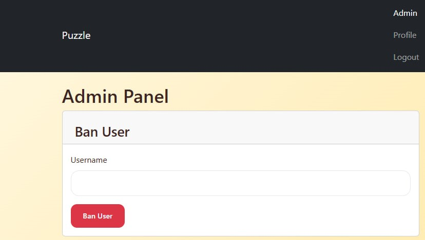

# Securinets CTF Quals 2025 - Puzzle 302 Write-up


## Challenge Summary & Technical Analysis

**Puzzle 302** was a multi-stage web application challenge that chained several vulnerabilities to achieve full access and retrieve the flag. The intended solution path required exploiting a privilege escalation during registration, leveraging an Insecure Direct Object Reference (IDOR) to establish a connection with an administrator, leaking the admin's credentials via an information disclosure bug, and finally using the acquired admin privileges to access and analyze files leading to the flag.

This write-up provides a step-by-step walkthrough of the exploitation process, supplemented with analysis of the underlying source code vulnerabilities.

---

### Step 1: Privilege Escalation via Parameter Tampering

The initial foothold was gained by exploiting a lack of server-side validation in the user registration process.

**Vulnerability Analysis (`auth.py`):**
The `/confirm-register` endpoint accepts a `role` parameter from the client. While it correctly blocks direct registration as an admin (`role` '0'), it fails to properly validate other inputs, trusting the client to send a default role of '2' (user).

```python
# From auth.py
def confirm_register():
    # ...
    role = request.form.get('role', '2') # Trusts the client-provided role
    # ...
    if role == '0':
        return jsonify({'error': 'Admin registration is not allowed.'}), 403
    # ...
    db.execute('INSERT INTO users (..., role) VALUES (..., ?)', (..., role))
```

By intercepting the registration POST request and changing the role parameter from the default value to 1, it was possible to create an account with "Editor" privileges.


### Step 2: IDOR in Collaboration Acceptance

With editor privileges, the next step was to interact with the admin user. I sent a collaboration request to the admin for a new article. The application's flaw was in how it handled the acceptance of these requests.

**Vulnerability Analysis (`main.py`):**
The `/collab/accept/<request_uuid>` endpoint was responsible for processing acceptances. The function checked if a user was authenticated but critically failed to verify that the logged-in user was the one the request was sent to.

```python
# From main.py
def accept_collaboration(request_uuid):
    if not session.get('uuid'): # Checks for login
        return jsonify({'error': 'Unauthorized'}), 401
    
    # ...
    c.execute("SELECT * FROM collab_requests WHERE uuid = ?", (request_uuid,))
    request = c.fetchone()
    
    # MISSING VULNERABLE CHECK: No validation to ensure session['uuid'] == request['to_uuid']
    
    c.execute("""
        INSERT INTO articles (..., author_uuid, collaborator_uuid)
        VALUES (?, ..., ?, ?)
    """, (..., request['from_uuid'], request['to_uuid']))
```

This allowed me to find the `request_uuid` in my own dashboard's HTML source and call the accept endpoint directly, unilaterally forcing the collaboration without any action from the admin.


### Step 3: Information Disclosure and Admin Account Takeover

The accepted collaboration now linked my editor account to the admin's account. This relationship, combined with the editor role's permissions, led to a critical information disclosure.

**Vulnerability Analysis (`main.py`):**
The `/users/<target_uuid>` API endpoint was intended to provide user details. Access was restricted to admins and editors. However, it lacked object-level access control, allowing an editor to request data for any user, including the admin. The endpoint also returned the user's password directly.

```python
# From main.py
def get_user_details(target_uuid):
    # ...
    # Checks if current user is admin ('0') or editor ('1')
    if not current_user or current_user['role'] not in ('0', '1'):
        return jsonify({'error': 'Invalid user role'}), 403
    
    # No check to see if the editor should be allowed to view the target_uuid
    # ...
    return jsonify({
        # ...
        'password': user['password'] # Leaks the password
    })
```

By finding the admin's UUID from the collaboration article's HTML and querying this endpoint, I retrieved the admin's plaintext password (somepass, as confirmed in models.py). I then logged out and logged back in as the admin user, completing the account takeover.




### Step 4: Accessing Protected Files and Retrieving the Flag

With full administrative access, I could now explore parts of the application that were previously restricted.

**Vulnerability Analysis (`main.py`):**
The `/data` directory listing and file-serving endpoints were protected by the `@admin_required` decorator. Access was only possible after the account takeover.

```python
# From main.py
@app.route('/data')
@admin_required # This previously blocked access
def list_data_files():
    # ...
```

Navigating to `/data` revealed two files: `secrets.zip` and `dbconnect.exe`.


The archive was password-protected. Reverse engineering the `dbconnect.exe` binary revealed a hardcoded password string. This password was the key to extracting the contents of `secrets.zip`, which contained the final flag.

