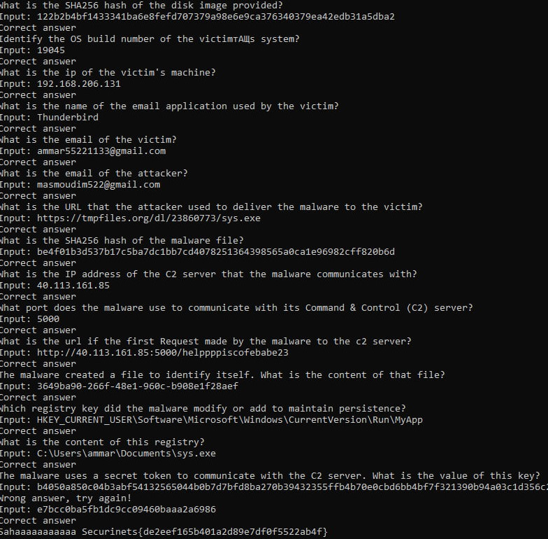

# Securinets CTF Quals 2025 - Silent Visitor 345 Write-up

File: [test.ad1](https://drive.google.com/file/d/1-usPB2Jk1J59SzW5T_2y46sG4fb9EeBk/view?usp=sharing)




```nc foren-1f49f8dc.p1.securinets.tn 1337```

### Step 1: What is the SHA256 hash of the disk image provided?
Input: ```122b2b4bf1433341ba6e8fefd707379a98e6e9ca376340379ea42edb31a5dba2```

### Step 2: Identify the OS build number of the victimтАЩs system?
Input: ```19045```

### Step 3: What is the ip of the victim's machine?
Input: ```192.168.206.131```

### Step 4: What is the name of the email application used by the victim?
Input: ```Thunderbird```

### Step 5: What is the email of the victim?
Input: ```ammar55221133@gmail.com```

### Step 6: What is the email of the attacker?
Input: ```masmoudim522@gmail.com```

### Step 7: What is the URL that the attacker used to deliver the malware to the victim?
Input: ```https://tmpfiles.org/dl/23860773/sys.exe```

### Step 8: What is the SHA256 hash of the malware file?
Input: ```be4f01b3d537b17c5ba7dc1bb7cd4078251364398565a0ca1e96982cff820b6d```

### Step 9: What is the IP address of the C2 server that the malware communicates with?
Input: ```40.113.161.85```

### Step 10: What port does the malware use to communicate with its Command & Control (C2) server?
Input: ```5000```

### Step 11: What is the url if the first Request made by the malware to the c2 server?
Input: ```http://40.113.161.85:5000/helppppiscofebabe23```

### Step 12: The malware created a file to identify itself. What is the content of that file?
Input: ```3649ba90-266f-48e1-960c-b908e1f28aef```

### Step 13: Which registry key did the malware modify or add to maintain persistence?
Input: ```HKEY_CURRENT_USER\Software\Microsoft\Windows\CurrentVersion\Run\MyApp```

### Step 14: What is the content of this registry?
Input: ```C:\Users\ammar\Documents\sys.exe```

### Step 15: The malware uses a secret token to communicate with the C2 server. What is the value of this key?
Input: ```e7bcc0ba5fb1dc9cc09460baaa2a6986```

