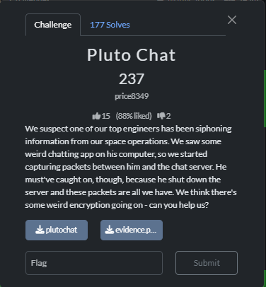

# SunshineCTF 2025 - Pluto Chat 237 Write-up



## Objective
We were given a `evidence.pcap` file containing captured network traffic and an executable file for a chat application, `plutochat`. The goal was to decrypt the conversation to find out what information a rogue engineer was leaking.

## Step 1: Program Analysis (Reverse Engineering)
First, we need to understand how the program encrypts its messages. To do this, we open the `plutochat` executable in a disassembler (like IDA).

### Finding the Encryption Entry Point
By analyzing functions related to network communications (like `send`), we find a key function, `sub_16A7`, which is responsible for sending messages. Inside it, we see a call to `sub_1510`, which, as it turns out, prepares the cipher.

```assembly
; Snippet from sub_16A7 (message sending function)
.text:00000000000016D8 mov     [rbp+var_C], eax     ; EAX contains the random 4-byte key
...
.text:0000000000001700 mov     edx, [rbp+var_C]     ; The key is passed in ESI/EDX
.text:0000000000001703 mov     rax, [rbp+var_18]    ; The future S-box buffer is passed in RDI/RAX
.text:0000000000001707 mov     esi, edx
.text:0000000000001709 mov     rdi, rax
.text:000000000000170C call    sub_1510             ; <--- CALL TO THE KEY SETUP FUNCTION
```
This function, `sub_1510`, is the core of the custom protection. It takes the 4-byte key and transforms it into a long, 80-byte key that is then used for the actual encryption. Let's break it down.

### Step 1.1: Key Expansion
The program takes the 4-byte key (a 32-bit integer) and repeats the following operation 20 times:
1.  Appends the current value of the key to an array (which will eventually become 80 bytes long).
2.  Performs a circular left shift (`ROL`) on the key. The number of bits to shift is determined by the key's own four least significant bits (`key & 0xF`).

```assembly
; Loop inside sub_1510, executed 20 times
.text:000000000000155B  mov     [rdx], eax           ; Store the current key in the array
...
.text:0000000000001560  and     eax, 0Fh             ; Get the 4 least significant bits to determine the shift amount
...
.text:000000000000156C  call    sub_14F8             ; This function performs the circular shift (rol edx, cl)
.text:0000000000001571  mov     [rbp+var_3C], eax    ; Update the key for the next iteration```
As a result, 4 bytes are expanded into 80.

### Step 1.2: Permutation with Constants
Next, the program takes this 80-byte array (treated as 20 4-byte numbers) and shuffles it using a hardcoded constant table found at address `.data:0000000000004100`.

```assembly
; Another loop inside sub_1510
.text:00000000000015A5 lea     rdx, unk_4100          ; Load the address of the constant table
.text:00000000000015AC movzx   eax, byte ptr [rax+rdx]  ; Read a byte from the table. It will be the index for the swap.
.text:00000000000015B3 lea     rdx, ds:0[rax*4]       ; Calculate the offset for the second element
...
; The following code swaps two 4-byte numbers in the array.
```
Here is the `unk_4100` table itself:
```
.data:0000000000004100 unk_4100 db  0Dh, 8, 11h, 0Ch, 0Eh, 7, 0, 5, 9, 4, 0Bh, 10h, 6, 12h, 0Ah, 1, 2, 3, 0Fh, 13h
```

### Step 1.3: Final Transformation
After the permutation, each byte in the 80-byte array is modified again using a second constant table (`unk_4120`) and an `XOR` operation with the result from the previous byte's transformation.

```assembly
; The third key processing loop in sub_1510
.text:000000000000162C movzx   eax, [rbp+var_21]      ; var_21 is the current byte from our 80-byte array
...
.text:0000000000001632 lea     rdx, unk_4120          ; Load the address of the second table
.text:0000000000001639 movzx   eax, byte ptr [rax+rdx]  ; Get a value from the table using the byte as an index
...
.text:000000000000164A xor     al, [rbp+var_1]      ; XOR with the previous result (stored in var_1)
.text:000000000000164D mov     [rdx], al            ; Store the new byte back into the array
.text:000000000000165F mov     [rbp+var_1], al      ; Update the "previous result" for the next iteration
```
The `unk_4120` table is a 256-byte substitution box.

### Step 1.4: S-box Generation and Encryption
Finally, the fully transformed 80-byte key is passed to the `sub_1389` function. This function is a classic implementation of the **RC4 Key-Scheduling Algorithm (KSA)**. It initializes a 256-byte state table (the S-box).

After that, to encrypt each byte of the message, the program calls `sub_12E5`, which implements the **RC4 Pseudo-Random Generation Algorithm (PRGA)**. It uses the S-box to generate one pseudo-random byte, and this byte is `XOR`ed with a byte of the original message to produce the ciphertext.

## Step 2: Writing the Decryption Script

Now that we understand the entire algorithm, we can write a Python script to reverse the process.

1.  **Extract Constants**: We copy the `unk_4100` and `unk_4120` tables directly from the disassembler into our Python script.
2.  **Replicate Key Setup**: We write a `custom_key_setup` function that precisely mimics all the steps from `sub_1510` (expansion, permutation, transformation).
3.  **Implement Decryption**: The core encryption algorithm is `XOR`. We write code that generates the identical keystream and `XOR`s it with the ciphertext to recover the plaintext.
4.  **Read the `.pcap` File**: Using the `scapy` library, our script reads the `evidence.pcap` file, finds all chat packets, extracts the 4-byte key and the encrypted message from each, and passes them to our decryption function.

### The Solution Code

Here is the complete code `solve.py` that accomplishes all of the above.

```python
import collections
from scapy.all import rdpcap, TCP, Raw

# These constants were extracted directly from the executable file
UNK_4100 = [
    0x0D, 0x08, 0x11, 0x0C, 0x0E, 0x07, 0x00, 0x05, 0x09, 0x04, 0x0B, 0x10,
    0x06, 0x12, 0x0A, 0x01, 0x02, 0x03, 0x0F, 0x13
]

UNK_4120 = [
    0xBA, 0x79, 0xCE, 0x55, 0x64, 0x13, 0x62, 0x21, 0xBF, 0xCC, 0x96, 0x0F,
    0x68, 0x95, 0x2D, 0x51, 0x7A, 0x59, 0xF6, 0x44, 0xE5, 0x43, 0x3E, 0xB3,
    0xA3, 0x81, 0x4F, 0xA6, 0x36, 0xFB, 0x6D, 0xF8, 0xF7, 0x1F, 0x6B, 0x42,
    0xA7, 0xB7, 0xBC, 0x71, 0x0D, 0xB4, 0xE0, 0xB9, 0x25, 0x0A, 0x28, 0xA1,
    0x76, 0x86, 0x6C, 0x27, 0xD9, 0x2A, 0x6A, 0x03, 0xF1, 0x72, 0xDB, 0x54,
    0x82, 0x6F, 0xBB, 0x1C, 0x5A, 0x38, 0xD2, 0xBE, 0x09, 0x9B, 0x15, 0xB8,
    0x8F, 0x78, 0x4C, 0x34, 0x67, 0xD7, 0xAB, 0x75, 0x45, 0x87, 0x9D, 0x10,
    0xE8, 0xEB, 0x32, 0x8D, 0xC5, 0x46, 0x65, 0x0B, 0x35, 0xBD, 0xEA, 0x06,
    0xA5, 0xDD, 0xA4, 0x5F, 0x40, 0x5D, 0xFC, 0x9A, 0x5B, 0xCB, 0x89, 0x91,
    0x5C, 0xFE, 0x66, 0xFD, 0xAA, 0x37, 0x02, 0x12, 0x98, 0x6E, 0x17, 0xC9,
    0x50, 0x20, 0x39, 0xC2, 0xED, 0xE7, 0xB2, 0x74, 0xE2, 0xEF, 0x16, 0x5E,
    0x99, 0x47, 0xF5, 0x1E, 0x23, 0x01, 0x57, 0xA0, 0x3B, 0x1B, 0x2B, 0xEE,
    0xC1, 0x58, 0x9E, 0xA9, 0xCA, 0xFF, 0xC4, 0x7B, 0x4B, 0x8E, 0x48, 0xCD,
    0x7C, 0xC0, 0x56, 0xD0, 0x33, 0xC7, 0x70, 0x8B, 0xE1, 0x8C, 0xC3, 0x0E,
    0x1D, 0x3D, 0xDA, 0xCF, 0x11, 0x73, 0xEC, 0xC6, 0x92, 0xB6, 0x26, 0x05,
    0xFA, 0xF0, 0xE6, 0x0C, 0x14, 0x69, 0x61, 0xC8, 0x60, 0x31, 0x9C, 0x22,
    0xAC, 0x9F, 0x4E, 0x49, 0x29, 0x3F, 0x85, 0xF3, 0x53, 0xF9, 0x63, 0xDF,
    0xD3, 0xF2, 0x00, 0x2E, 0x18, 0xD1, 0xDE, 0x8A, 0x52, 0x08, 0xE9, 0xA2,
    0xE4, 0x3A, 0x83, 0x7F, 0x94, 0xB5, 0xD4, 0xD5, 0x77, 0x07, 0xDC, 0x19,
    0x84, 0xD8, 0xAF, 0xA8, 0x93, 0x7E, 0xD6, 0x2C, 0xF4, 0x41, 0xB1, 0x2F,
    0x7D, 0x4D, 0x97, 0x1A, 0x3C, 0xB0, 0x80, 0x90, 0x4A, 0xAE, 0x24, 0x88,
    0xAD, 0x04, 0x30, 0xE3
]


def rol32(n, d):
    return ((n << d) | (n >> (32 - d))) & 0xFFFFFFFF


def custom_key_setup(initial_key_int: int) -> bytes:
    state_dwords = [0] * 20
    current_key = initial_key_int
    for i in range(20):
        state_dwords[i] = current_key
        rot = current_key & 0xF
        current_key = rol32(current_key, rot)

    for i in range(20):
        swap_idx = UNK_4100[i]
        if 0 <= swap_idx < 20:
            state_dwords[i], state_dwords[swap_idx] = state_dwords[swap_idx], state_dwords[i]

    state_bytes = bytearray()
    for dword in state_dwords:
        state_bytes.extend(dword.to_bytes(4, 'little'))

    last_val = 0
    for i in range(80):
        tmp = state_bytes[i]
        result = UNK_4120[tmp] ^ last_val
        state_bytes[i] = result
        last_val = result

    return bytes(state_bytes)


def key_scheduling_rc4(key: bytes) -> list:
    sched = list(range(256))
    j = 0
    key_len = len(key)
    for i in range(256):
        j = (j + sched[i] + key[i % key_len]) % 256
        sched[i], sched[j] = sched[j], sched[i]
    return sched


def pseudo_random_generation(sched: list):
    i = 0
    j = 0
    while True:
        i = (i + 1) % 256
        j = (j + sched[i]) % 256
        sched[i], sched[j] = sched[j], sched[i]
        yield sched[(sched[i] + sched[j]) % 256]


def decrypt_message(msg_key_bytes: bytes, ciphertext: bytes) -> bytes:
    initial_key = int.from_bytes(msg_key_bytes, 'little')
    effective_key = custom_key_setup(initial_key)
    s_box = key_scheduling_rc4(effective_key)
    keystream = pseudo_random_generation(s_box)
    plaintext = bytes([c ^ next(keystream) for c in ciphertext])
    return plaintext


def process_pcap(pcap_file: str):
    print(f"[*] Analyzing file {pcap_file}...")
    try:
        packets = rdpcap(pcap_file)
    except FileNotFoundError:
        print(f"[!] Error: File '{pcap_file}' not found.")
        return

    streams = collections.defaultdict(bytes)
    for packet in packets:
        if TCP in packet and Raw in packet:
            src_ip, dst_ip = packet['IP'].src, packet['IP'].dst
            src_port, dst_port = packet['TCP'].sport, packet['TCP'].dport
            stream_key = tuple(sorted(((src_ip, src_port), (dst_ip, dst_port))))
            streams[stream_key] += packet[Raw].load

    print(f"[*] Found {len(streams)} TCP streams with data.")
    for stream_key, data in streams.items():
        print(f"\n--- Decrypting stream: {stream_key[0]} <-> {stream_key[1]} ---")
        cursor = 0
        while cursor + 8 <= len(data):
            msg_key = data[cursor:cursor + 4]
            msg_len = int.from_bytes(data[cursor + 4:cursor + 8], 'little')
            cursor += 8
            if cursor + msg_len > len(data):
                break

            ciphertext = data[cursor:cursor + msg_len]
            try:
                plaintext = decrypt_message(msg_key, ciphertext)
                msg_type = plaintext[0]

                if msg_type == 0:  # Login
                    user_len = plaintext[1]
                    username = plaintext[2:2 + user_len].decode(errors='ignore')
                    pass_start = 2 + user_len
                    pass_len = plaintext[pass_start]
                    password = plaintext[pass_start + 1:pass_start + 1 + pass_len].decode(errors='ignore')
                    print(f"[*] Login packet: Username='{username}', Password='{password}'")

                elif msg_type == 1:  # Successful server response
                    print(f"[*] Server response: [Status: Login successful]")

                elif msg_type == 2:  # Chat message (sent)
                    to_user_len = plaintext[1]
                    to_user = plaintext[2:2 + to_user_len].decode(errors='ignore')
                    msg_start = 2 + to_user_len
                    msg_len_val = plaintext[msg_start]
                    message = plaintext[msg_start + 1:msg_start + 1 + msg_len_val].decode(errors='ignore')
                    print(f"[*] Chat message -> To: '{to_user}', Text: '{message}'")

                elif msg_type == 3:  # Chat message (received)
                    from_user_len = plaintext[1]
                    from_user = plaintext[2:2 + from_user_len].decode(errors='ignore')
                    msg_start = 2 + from_user_len
                    msg_len_val = plaintext[msg_start]
                    message = plaintext[msg_start + 1:msg_start + 1 + msg_len_val].decode(errors='ignore')
                    print(f"[*] Chat message -> From: '{from_user}', Text: '{message}'")

                else:
                    print(f"[*] Unknown message type ({msg_type})")
            except Exception as e:
                print(f"[!] Decryption error: {e}")
            cursor += msg_len


if __name__ == '__main__':
    PCAP_FILENAME = 'evidence.pcap'
    process_pcap(PCAP_FILENAME)
```

## Step 3: Results

After running the script, we get a full decryption of the engineer's conversation.


The results show two separate login sessions:
1.  **User:** `topsecretengineer` with **Password:** `PlutoMars23!`
2.  **User:** `givemethemoney` with **Password:** `Sellurdata12!`

In both sessions, they exchange the same sensitive information. The user `givemethemoney` asks for a "sensitive key", and the user `topsecretengineer` provides it.

The flag is revealed in the chat:
`sun{S3cur1ty_thr0ugh_0bscur1ty_1s_B4D}`
