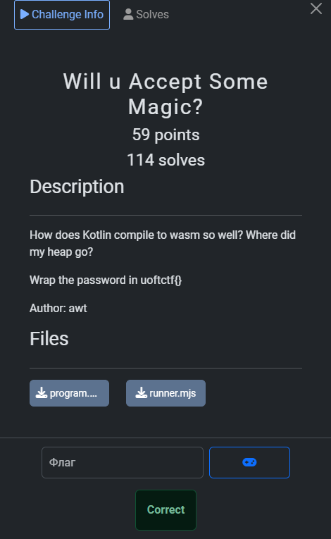
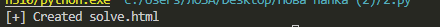
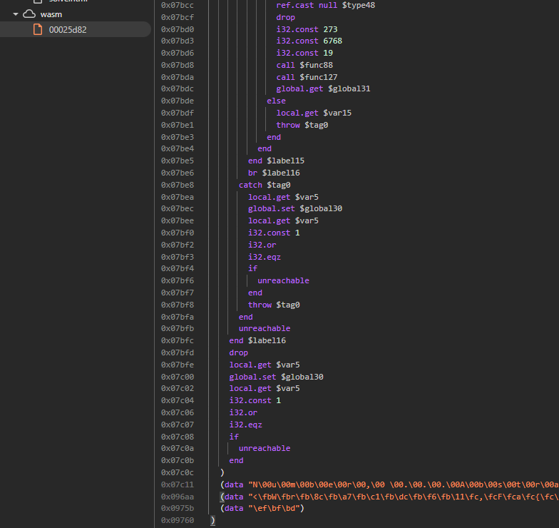
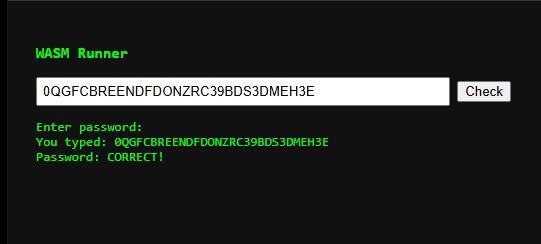

## UofTCTF 2026 - Will u Accept Some Magic? Write-up



### Step 1: Initial Reconnaissance

The challenge provided a `program.wasm` file compiled from Kotlin, along with a JavaScript runner. The description hinted at memory management changes ("Where did my heap go?"), implying the use of **Wasm GC (Garbage Collection)**, a modern WebAssembly feature where memory is managed by the host engine rather than linear memory.

I attempted to execute the provided `runner.mjs` locally using Node.js, but it failed to run because my local environment did not support the experimental Wasm GC features required by the binary.

I performed a quick string analysis (`strings` looking for UTF-16LE) and found interesting candidates like `infinite_loop_detected` and `lucky_position`, but these turned out to be internal state names rather than the flag itself.

### Step 2: Attempting Browser Emulation

Since modern browsers (Chrome/Edge) have native support for Wasm GC, I decided to bypass Node.js by creating a standalone HTML runner. I wrote a Python script to embed the `program.wasm` as a Base64 string into an HTML file with a minimal WASI (WebAssembly System Interface) polyfill.



However, upon running the generated `solve.html`, the browser threw a `LinkError`. The binary required the `wasi_snapshot_preview1.random_get` function, which wasn't implemented in the initial minimal polyfill.

### Step 3: Static Analysis of the .wat Dump

The error provided an opportunity to inspect the code structure deeper. We decompiled the binary to the WebAssembly Text Format (`.wat`).



The code was dense, but I located a massive function, **`func246`** (visible in the screenshot above), which appeared to be the core validation logic. It acted as a dispatcher/switch-statement processing the input string index-by-index (from 0 to 29).

By tracing the logic inside `func246`, I mapped out which validation function was called for each character index. Each of these sub-functions simply returned a hardcoded integer constant—the ASCII value of the expected character.

**The Logic Map:**

| Index | Function | Value (ASCII) | Char |
| :--- | :--- | :--- | :--- |
| 0 | `func139` | 48 | **0** |
| 1 | `func143` | 81 | **Q** |
| 2 | `func147` | 71 | **G** |
| 3 | `func151` | 70 | **F** |
| 4 | `func155` | 67 | **C** |
| 5 | `func159` | 66 | **B** |
| 6 | `func163` | 82 | **R** |
| 7 | `func167` | 69 | **E** |
| 8 | `func167` | 69 | **E** |
| 9 | `func174` | 78 | **N** |
| 10 | `func178` | 68 | **D** |
| 11 | `func151` | 70 | **F** |
| 12 | `func178` | 68 | **D** |
| 13 | `func188` | 79 | **O** |
| 14 | `func174` | 78 | **N** |
| 15 | `func195` | 90 | **Z** |
| 16 | `func163` | 82 | **R** |
| 17 | `func155` | 67 | **C** |
| 18 | `func205` | 51 | **3** |
| 19 | `func209` | 57 | **9** |
| 20 | `func159` | 66 | **B** |
| 21 | `func178` | 68 | **D** |
| 22 | `func219` | 83 | **S** |
| 23 | `func205` | 51 | **3** |
| 24 | `func178` | 68 | **D** |
| 25 | `func229` | 77 | **M** |
| 26 | `func167` | 69 | **E** |
| 27 | `func236` | 72 | **H** |
| 28 | `func205` | 51 | **3** |
| 29 | `func167` | 69 | **E** |

Reassembling these characters gave us the password: **`0QGFCBREENDFDONZRC39BDS3DMEH3E`**.

### Step 4: Verification with Custom Runner

To confirm the finding dynamically, I updated the Python generator script to include the missing `random_get` implementation and generated the final `solve.html`.

```python
import base64
import os

def create_solver():
    if not os.path.exists("program.wasm"):
        print("[-] program.wasm not found!")
        return

    with open("program.wasm", "rb") as f:
        wasm_b64 = base64.b64encode(f.read()).decode()

    html_content = f"""
<!DOCTYPE html>
<html>
<head>
    <title>WASM Solver</title>
    <style>body {{ background: #111; color: #0f0; font-family: monospace; padding: 20px; }} input {{ width: 400px; padding: 5px; }}</style>
</head>
<body>
    <h3>WASM Runner</h3>
    <input type="text" id="passInput" value="">
    <button onclick="run()">Check</button>
    <pre id="output"></pre>
    <script>
        const wasmBase64 = "{wasm_b64}";
        const wasmBytes = Uint8Array.from(atob(wasmBase64), c => c.charCodeAt(0));
        
        const wasiImports = {{
            wasi_snapshot_preview1: {{
                fd_write: (fd, iovs, iovs_len, nwritten) => {{
                    const mem = new DataView(wasmInstance.exports.memory.buffer);
                    let str = "";
                    for (let i = 0; i < iovs_len; i++) {{
                        const ptr = mem.getUint32(iovs + i * 8, true);
                        const len = mem.getUint32(iovs + i * 8 + 4, true);
                        const chunk = new Uint8Array(wasmInstance.exports.memory.buffer, ptr, len);
                        str += new TextDecoder().decode(chunk);
                    }}
                    document.getElementById("output").innerText += str;
                    return 0;
                }},
                fd_read: (fd, iovs, iovs_len, nread) => {{
                    const mem = new DataView(wasmInstance.exports.memory.buffer);
                    const ptr = mem.getUint32(iovs, true);
                    const encoder = new TextEncoder();
                    const bytes = encoder.encode(currentPass + "\\n");
                    new Uint8Array(wasmInstance.exports.memory.buffer, ptr, bytes.length).set(bytes);
                    mem.setUint32(nread, bytes.length, true);
                    return 0;
                }},
                // Fix: Add random_get implementation
                random_get: (buf, buf_len) => {{
                    const mem = new Uint8Array(wasmInstance.exports.memory.buffer);
                    for (let i = 0; i < buf_len; i++) {{
                        mem[buf + i] = (Math.random() * 256) | 0;
                    }}
                    return 0;
                }},
                poll_oneoff: () => 0,
                proc_exit: () => {{ throw "EXIT"; }},
                clock_time_get: () => 0, environ_sizes_get: () => 0, environ_get: () => 0, args_sizes_get: () => 0, args_get: () => 0, fd_seek: () => 0, fd_close: () => 0, fd_fdstat_get: () => 0
            }}
        }};

        let wasmInstance;
        let currentPass = "";

        async function run() {{
            document.getElementById("output").innerText = "";
            currentPass = document.getElementById("passInput").value;
            try {{
                const module = await WebAssembly.compile(wasmBytes);
                wasmInstance = await WebAssembly.instantiate(module, wasiImports);
                wasmInstance.exports._initialize();
            }} catch (e) {{
                if (e !== "EXIT") console.error(e);
            }}
        }}
    </script>
</body>
</html>
    """
    with open("solve.html", "w") as f: f.write(html_content)
    print("[+] Created solve.html")

if __name__ == "__main__":
    create_solver()
```

I ran the script, opened `solve.html` in the browser, and clicked "Check".



The application confirmed the password was correct.

### Flag
`uoftctf{0QGFCBREENDFDONZRC39BDS3DMEH3E}`