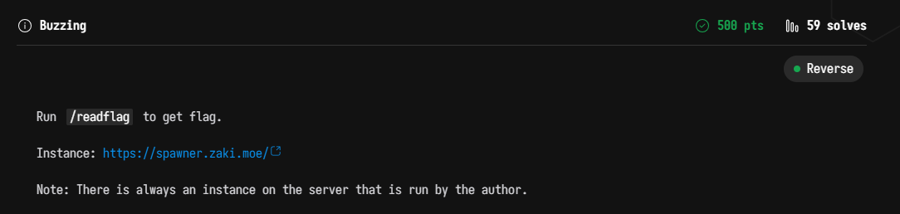
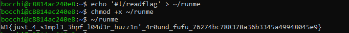

# WannaGame Championship 2025 - Buzzing Write-up



## Step 1: Reconnaissance & Analysis
Upon logging in, we identified that `/readflag` had the SUID bit set, which is necessary to read the flag file. However, attempting to run it directly resulted in `Permission denied`.

```bash
bocchi@b9f1234b0fbb:~$ ls -l /readflag /locker.bpf.o
-rw-r--r-- 1 root root  5768 Dec  6 05:35 /locker.bpf.o
-rwsr-xr-x 1 root root 14456 Dec  6 05:35 /readflag

bocchi@b9f1234b0fbb:~$ /readflag
-bash: /readflag: Permission denied
```

### Identifying the "Catch-22"
Through various testing methods (trying to copy the binary, using the dynamic linker, etc.), we deduced that the eBPF program implements two conflicting rules:

1.  **Execution Block (`execve` hook):** The system blocks the execution of any binary if its filename or path contains `readflag`. This prevents direct execution.
2.  **Process Name Check (`openat` hook):** The `/readflag` binary (or a secondary hook) verifies its own process name (`comm`). If the process is not named `readflag`, it refuses to read the flag (outputting `Error: flag file not found`).

This creates a paradox:
*   We cannot run a file named `readflag` (blocked by Rule 1).
*   We cannot run a file with a *different* name (e.g., via `ld-linux` or renaming), because the process name won't be `readflag` (blocked by Rule 2).

## Step 2: The Bypass Strategy (Shebang `#!`)
The solution relies on how the Linux kernel handles scripts with a **Shebang** (`#!`). When a script is executed, the kernel reads the first line to find the interpreter. It then executes the **interpreter** directly, passing the script as an argument.

This behavior allows us to bypass both filters simultaneously:
1.  We create a script with a random name (e.g., `~/runme`). Since the filename is not `readflag`, **Rule 1 allows execution**.
2.  We set the shebang to `#!/readflag`. The kernel executes `/readflag` as the interpreter.
3.  Because the kernel is launching the `/readflag` binary directly, the process name (`comm`) becomes `readflag`. This satisfies **Rule 2**.

## Step 3: Execution

We implemented the bypass using the following commands:

```bash
# 1. Create a dummy script with /readflag as its interpreter
echo '#!/readflag' > ~/runme

# 2. Make the script executable
chmod +x ~/runme

# 3. Execute the script. 
# The kernel launches /readflag (passing Rule 1 check on 'runme' and Rule 2 check on process name)
~/runme
```

## Step 4: Results

The bypass was successful. The eBPF filter allowed the script to run, and the `/readflag` binary—running with the correct process name and SUID privileges—successfully retrieved the flag.



Flag: `W1{just_4_s1mpl3_3bpf_l04d3r_buzz1n'_4r0und_fufu_76274bc788378a36b3345a49948045e9}`