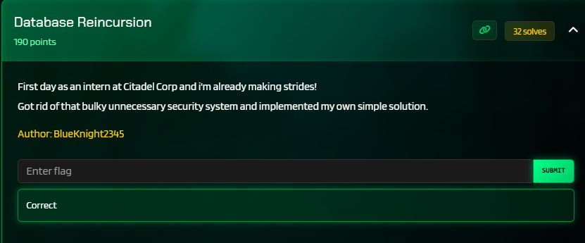
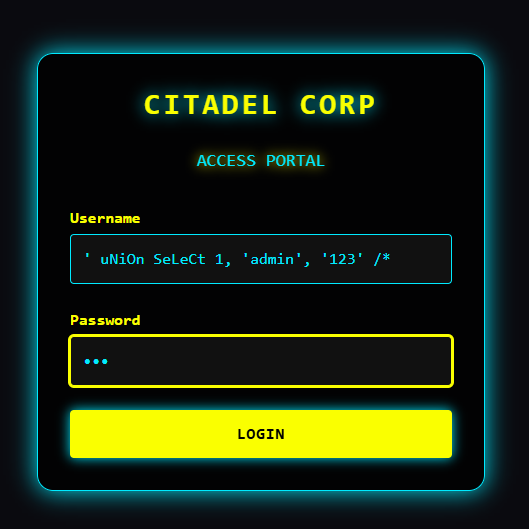
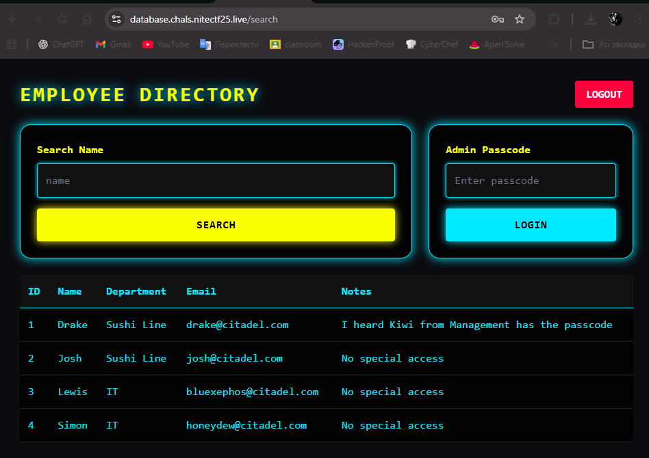
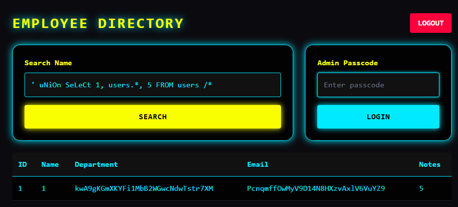
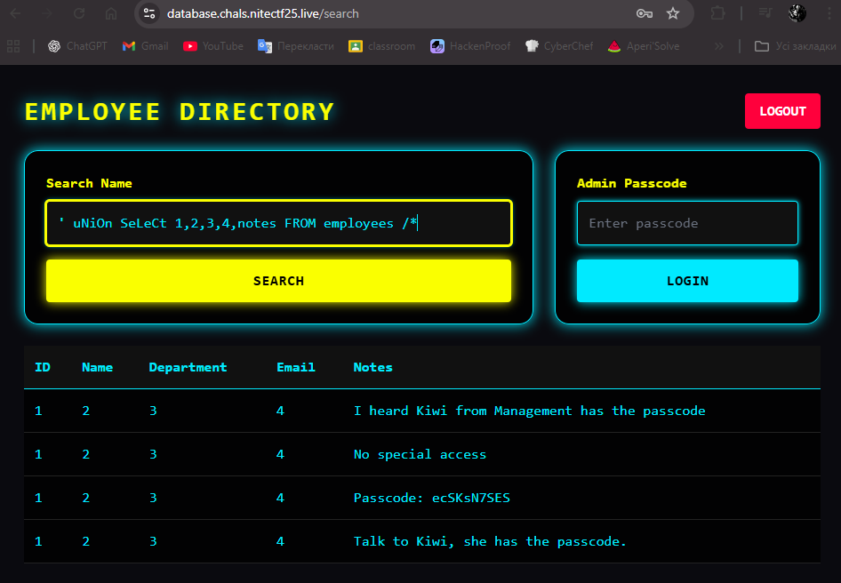
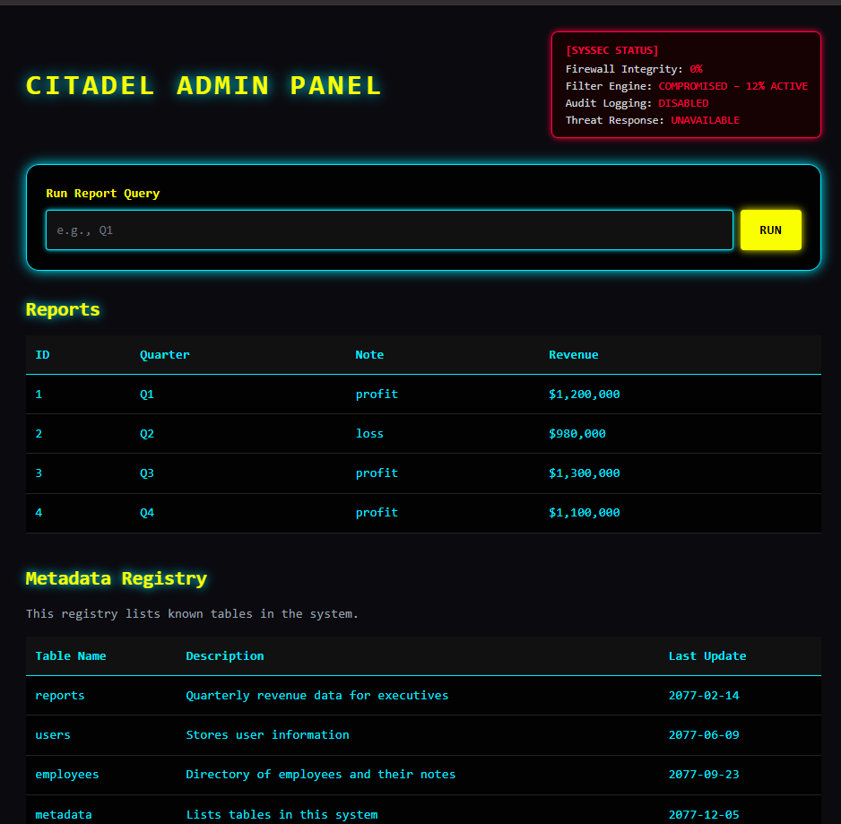
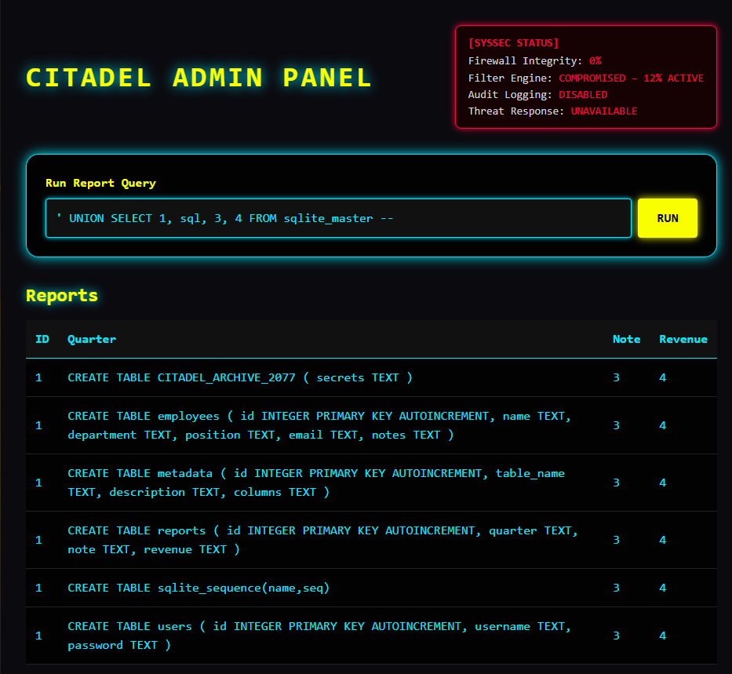
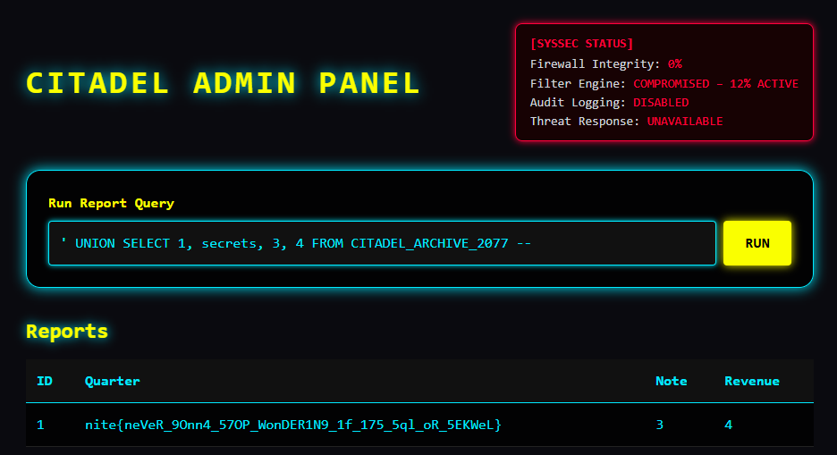

# niteCTF 2025 - Database Reincursion Write-up



### Step 1: Authentication Bypass via Case-Sensitive SQL Injection

The first step was to bypass the login page. Standard payloads were blocked, but the filter proved to be case-sensitive and allowed alternative comment styles.

**Vulnerability Analysis:**
The filter blocked the `UNION` keyword but not `uNiOn`. It also blocked `--` comments but allowed `/*`. Combining these two bypass techniques allowed for the creation of a payload that forged a fake user `admin` with the password `123`, successfully passing authentication.

**Payload:**
```sql
' uNiOn SeLeCt 1, 'admin', '123' /*
```



### Step 2: Information Disclosure and Admin Passcode Extraction

After logging in, we land on an employee directory. A key hint on the page states: *"I heard Kiwi from Management has the passcode"*. This indicates that the next step is to find this passcode.



**Vulnerability Analysis:**
The search form was vulnerable to the same type of SQL injection. Initial enumeration using the payload `' uNiOn SeLeCt 1, users.*, 5 FROM users /*` revealed the existence of a `users` table with three columns, but the data within was a red herring and did not lead to the solution.



Returning to the `employees` table and the hint, it became clear the necessary information was in the `notes` column. The filter did not block this column name. A payload to dump the contents of this column for all employees (including hidden ones) allowed for the passcode to be found.

**Payload:**
```sql
' uNiOn SeLeCt 1,2,3,4,notes FROM employees /*
```
Among the dumped notes was the line: **`Passcode: ecSKsN7SES`**.



### Step 3: Admin Panel Access & Database Schema Enumeration

Using the found passcode, we gain access to the admin panel.



**Vulnerability Analysis:**
Inside the admin panel, a system security status widget indicated `Filter Engine: COMPROMISED`, which meant all filters were disabled. The new "Run Report Query" field was vulnerable to classic SQL injection. This allowed the use of a standard query to read the `sqlite_master` table and enumerate the entire database structure.

**Payload:**
```sql
' UNION SELECT 1, sql, 3, 4 FROM sqlite_master --
```
This query dumped the schema for all tables, revealing a new, secret table: **`CITADEL_ARCHIVE_2077`**, which contained a `secrets` column.



### Step 4: Final Flag Extraction

The last step is to read the contents of the discovered secret table.

**Vulnerability Analysis:**
With all filters disabled, nothing prevented a direct query to read the data from the `secrets` column.

**Payload:**
```sql
' UNION SELECT 1, secrets, 3, 4 FROM CITADEL_ARCHIVE_2077 --
```
Executing this query returned the final flag in the "Quarter" field.



**Flag:** `nite{neVeR_9Onn4_57OP_WonDER1N9_1f_175_5ql_oR_5EKWeL}`